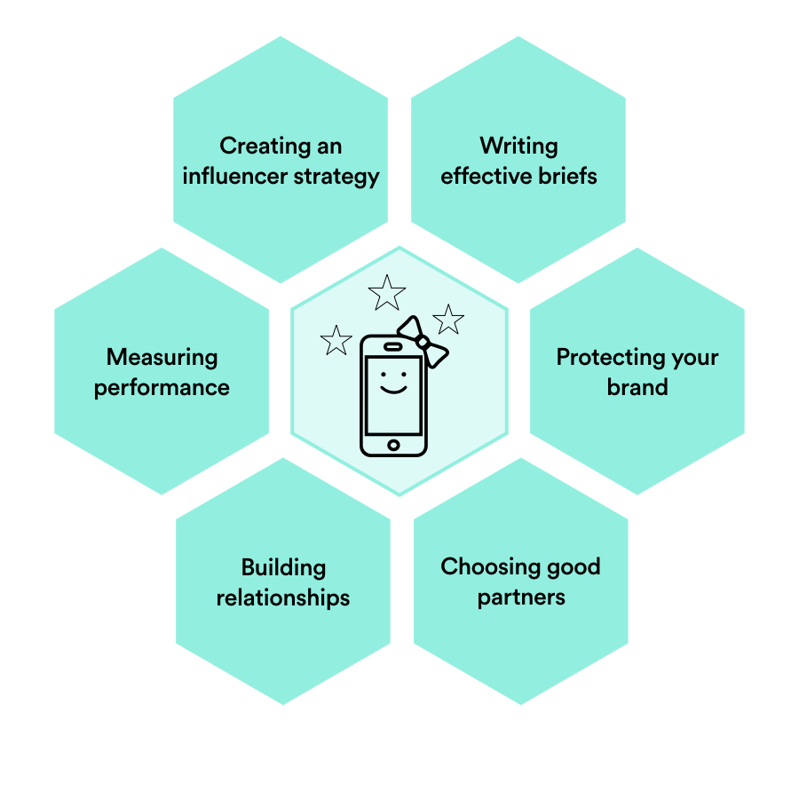
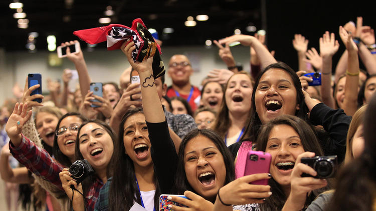

###### Influencer Marketing
# Learning Path: Getting Started

| Lesson Assets    |
| ---------------- |
| [assets](lesson0/assets) |

----------------------------------

### Lesson + Instructor Info

_Lesson Title_:   Learning Path: Getting Started

_Duration* (minutes)_:  20

### Summary Messages

##### Intro Screen
_Intro Message_:

### About this unit

Influencer marketing is very personal and context-dependent, so designing a successful influencer strategy can be more of an art than a science.  

However, there are some general skills you’ll need no matter what type of influencer marketing you’re doing.

These are the skills we’ll help you develop in this unit. We will refer back to this honeycomb as a guide to show you your progress.

Download the [Influencer Marketing Skills Honeycomb](assets/Influencer Honeycomb.png).                                     

##### Topics

* Skills framework
* Expert contributors
* Pre-survey

##### References & Next Steps
 [Josiah Wedgewood story](http://www.adweek.com/digital/sherry-gray-guest-post-how-brands-can-identify-the-best-influencers/)

http://www.ibtimes.co.uk/selfie-queen-kim-kardashian-paid-12k-minute-take-snaps-influencers-hamptons-bash-1571444

https://blog.unmetric.com/how-maybelline-became-the-best-performing-beauty-brand-on-instagram-in-indonesia?hsFormKey=1dc43e3b9bf438c1ff6821e70e0abcfd

https://digiday.com/marketing/micro-influencers/

http://www.smithsonianmag.com/arts-culture/250-years-of-wedgwood-143057153/

https://www.thinkwithgoogle.com/marketing-resources/aeropostale-bethany-mota-partnership/

[McKinsey](http://www.mckinsey.com/business-functions/marketing-and-sales/our-insights/a-new-way-to-measure-word-of-mouth-marketing)

[DeLoitte](https://www.forbes.com/sites/danielnewman/2015/06/23/love-it-or-hate-it-influencer-marketing-works/#1631a068150b)

[J House Vlogs](https://www.youtube.com/watch?v=Oawf-pWEgXI)

[Linqia pay less for influencer marketing, slide 6](http://www.linqia.com/wp-content/uploads/2017/04/The-Value-of-Influencer-Content-2017_Final_Report.pdf)

[Maybelline Instagram post](http://www.campaignasia.com/article/engagement-meter-the-weeks-top-brand-posts-on-facebook-twitter-and-instagram/406420)

[1% Millennials trust ads](http://www.linqia.com/wp-content/uploads/2016/08/The-Influencer-Marketing-Landscape-2016.pdf)

[Vidcon](http://press-start.com.au/news/2016/06/23/vidcon-coming-melbourne-2017/)

[The Blonde Salad](https://www.youtube.com/watch?v=8mIO8l0pH_0)

[DJ Khaled Vegas takeover](www.multivu.com/players/English/7842851-lvcva-dj-khaled/)

[Bethany Mota Aeropostale](https://www.thinkwithgoogle.com/marketing-resources/aeropostale-bethany-mota-partnership/)

----------------------------------
<!-- 1 -->
### Slideshow

_Slide Title_: Influencer Experts

GA worked with a number of influencer experts to develop this unit. Our leading contributors (and influencer marketing superstars) are:

---
<!-- 2 -->
_Slide Title_: Pre-Survey

Before you start the other lessons, please take a brief pre-survey to evaluate your current influencer knowledge.
We’ll have an additional assessment at the end for you to see how far you’ve grown, and collect your feedback on the influencer marketing unit.
Now you’re ready to dive into the world of influencers!

Young fans wait to meet their favorite YouTubers at Vidcon. Image: LA Times

---
<!-- 3 -->
Knowledge Check:

_prompt_:
Which of the following would NOT be considered influencer marketing?

_Choices_:
1. Hiring a popular photographer to take over your company’s Instagram account for a month.
2. Creating content with the goal of getting industry thought leaders to engage with it.
3. Buying followers for your social media accounts so that your brand appears more influential. *
4. Posting a video of an YouTube star interviewing your executive leadership team.

_Explanation_:

---
<!-- 4 -->
Knowledge Check:

_Prompt_:
If you’re trying to sell your company leadership on influencer marketing, which of these points might you highlight?

_Choices_:

_Explanation_:

---
<!-- 5 -->
Knowledge Check:

_Prompt_:
What should you always make sure of when embarking on an influencer marketing campaign?

_Choices_:
1. That your brand’s account on the social platform used in the influencer campaign is in good shape
2. That no one has ever left a negative comment about sponsorships on the influencer’s account
3. That the influencer is a follower of your brand
4. That your influencer has more than 1 million followers

_Explanation_:
Exactly. You don’t potential customers to come to your channel and be met with a different experience than what attracted them in the influencer’s posts. The other answers may be qualities you desire, but are not a necessity for successful influencer marketing.
