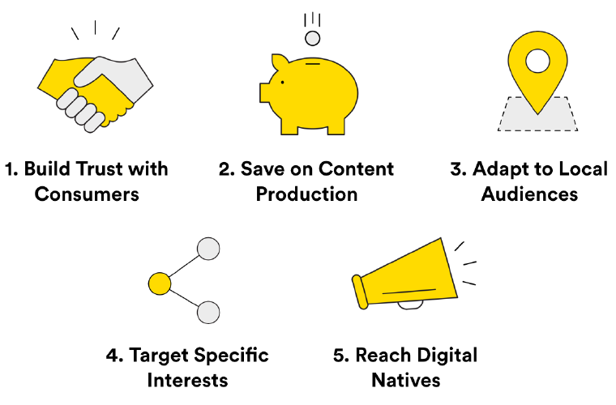

###### Influencer Marketing
# Intro to influencer marketing

| Lesson Assets    |
| ---------------- |
| [assets](assets/) |

----------------------------------
### Lesson + Instructor Info

_Lesson Title_: Intro to influencer marketing

_Duration* (minutes)_:  20

### Summary Messages

##### Topics

* What is influencer marketing?
* The benefits of influencer marketing.
* Seven ways you can work with influencers.

##### References & Next Steps

_Further Study_:
Influencer marketing is poised to represent a bigger and bigger share of marketing budgets in the coming years. We hope this series of lessons will guide you on your way.

- Read Forbes’ analysis of [Why Influencer Marketing will Explode in 2017.](https://www.forbes.com/sites/ajagrawal/2016/12/27/why-influencer-marketing-will-explode-in-2017/#2fc96f0120a9)
- Brandwatch, a social listening and influencer marketing platform, publishes a [series of interviews](https://www.brandwatch.com/blog/tag/interview) with influencer marketers, including an interview with our own contributor [Philip Brown](https://www.brandwatch.com/blog/influencer-marketing-philip-brown/).
- Take a closer look at the influencers in your own social feeds, and look for posts designated as sponsorships with an #ad, #sp, or other disclosure. Dig in and take a diagnostic look at other brands’ campaigns.

----------------------
### Slideshow
<!-- 1 -->
_Slide Title_: What Is Influencer Marketing?

Influencer marketing is the practice of engaging people with social influence to promote your brand.

Although it has become a buzzword in recent years, influencer marketing is nothing new. In fact, the first known “influencer marketing campaign” happened way back in the 1760s, when English potter Josiah Wedgwood promoted his tableware by associating it with the celebrities of the day. Wedgwood publicly exhibited the china he made for a royals like Catherine the Great and then sold replicas to the middle class at a reduced rate. Wedgewood’s dishes are still in demand today!

Wedgwood’s “Catherine the Great Green Frog Service.”
---
<!-- 2 -->
_Video Link: https://generalassembly.wistia.com/medias/nqcz5w80qr

_Video Transcript_: "Influence, to me, is when you can impact someone’s behavior, their character, and their development to ultimately change either their behavior itself or their perception of a brand, of a social cause, or even a political perspective.

The reality is, everyone has influence, right? You have influence over your friends online. You have influence over your friends in person.
But some individuals have grown their audiences online to the scale where they have hundreds of millions of followers. Sometimes these followers consider them to be friends.

And what these influencers say to them — it matters. It means something, and it resonates with their fans. So if an influencer says, ‘Watch this movie,” or ‘Try this candy bar,’ they typically do it!

That’s what influence is, and when it comes to influencer marketing, influencer marketing really is word-of-mouth marketing that’s been accelerated by technology and by social media.”

---
<!-- 3 -->
_Slide Title_: Is Influencer Marketing a Form of Paid, Earned, or Owned Media?

Although it has become common practice, influencer marketing doesn’t always involve paying someone to promote your brand. Influencer marketing has a role in paid, earned, AND owned media.

* Paid media: For a fee, those who have built up a significant social media following will promote your brand by creating content, sharing your content, and/or appearing at events.

* Earned media: Unpaid influencers, or brand advocates, will promote your brand without compensation. They do this because they truly love your content or product and want to share it with their followers.

* Owned media: Whether or not you have paid an influencer, you might use influencer-created content in your brand’s channels. For example, you could use an influencer’s photos on your website or re-post their content on your brand’s social media channels.

---
<!-- 4 -->
_Slide Title_: Influencer Marketing Is on the Rise

Although influencer marketing has been around for a while, it’s a hot topic in digital marketing right now. This is due to both the rise of social media and the unique benefits it offers.
In the next section, we’ll take a look at five key benefits of influencer marketing:

---
<!-- 5 -->
_Slide Title_: Benefit #1: Build Trust With Consumers

Influencer marketing gets its power from the trust that already exists between influencers and their followers. A successful influencer campaign can extend that trust to your brand.

You can think of influencer marketing as an extension of word-of-mouth marketing, which we all know works well in the “offline” world. According to McKinsey & Company, word-of-mouth marketing is the primary factor in 20–50 percent of purchases. And Deloitte reports that customers acquired through word of mouth have a 37 percent higher retention rate than customers acquired by other means.

---
<!-- 6 -->
Remember that word of mouth is only effective when that trust is upheld. If you pay an influencer to promote something they don’t genuinely believe in, it can backfire on your campaign.

In this example, a Canon influencer (Kendra from J House Vlogs) created content that showcased the Canon EOS Rebel’s capabilities, sparked conversation with her audience, and promoted the camera to her fans in an authentic way that developed trust in the product.

Image: YouTube // J House Vlogs

---
<!-- 7 -->
_Slide Title_: Benefit #2: Save on Content Production

In traditional marketing campaigns, the cost of creating content — writing copy, producing videos, etc.— is separate from the cost of distributing that content through media channels.
This is not the case with influencer marketing. Influencers act as both content creators and distributors, so you pay them once to both create and distribute content to your target audience.
As a result, influencer campaigns are often highly cost effective. According to a study by Linqia, brands pay about 2.6 times less for influencer-created content than for similar, professionally created content.

---
<!-- 8 -->
_Slide Title_: Benefit #3: Adapt Content to Local Markets

Multinational brands often struggle to adapt their centrally produced campaigns to regional markets. Local influencers can produce and distribute content that will resonate with fans in a given region.
For instance, Maybelline Indonesia worked with local beauty influencers to become the best-performing brand on Instagram in 2016. The company’s regram of an ambassador post by Pevita Pearce was one of the most engaging posts in Asia the week it ran.
Check out the case study here.

Image: Instagram / Maybellineina

---
<!-- 9 -->
_Slide Title_: Benefit #4: Target Specific Interests

Data sets are helpful for targeting specific audiences but have their limitations. In some cases, you can target users more accurately through influencers who have built a following around a certain interest.

Let’s say you are trying to reach DIY enthusiasts. A data segment for DIY enthusiasts might include many individuals who you don’t actually care about (e.g., a grandma who bought a toolkit for her grandson’s birthday). However, there’s a good chance that subscribers to HomeMadeModern on YouTube are the real deal.

---
<!-- 10 -->
_Slide Title_: Benefit #5: Reach Digital Natives

In today’s fragmented world, many marketers struggle to get audiences to pay attention to their messages. And if your targeted users are using ad blockers, your message won’t reach them at all.

Influencer marketing sidesteps this problem nicely: Influencers’ followers already want to hear what they have to say. This is especially important when you consider the skepticism that millennials have toward marketing in general (some studies have found that only 1 percent of millennials trust ads).

---
<!-- 11 -->
To see this phenomenon in action, let’s review this case study from October 2016. A popular Chinese influencer challenged followers to message their boyfriends on WeChat and ask for a YSL Star Clash Lipstick.

The influencer’s followers accepted the challenge, increasing visibility for the post, and this led to the sale of more than 1 million lipsticks — temporarily selling out the line.

Image: YSL’s Star Clash Lipstick / Pinterest.

---
<!-- 12 -->
_Slide Title_: Despite its Benefits, Influencer Marketing Takes Some Adjusting

This adjustment is especially challenging for large, traditional brands, because influencer marketing requires giving up a certain degree of creative control.

Giving up control is tough for brands that are used to being the custodians of brand voice. Handing that over to a 16-year-old Instagrammer can be terrifying — but can also bring results you never expected.

---
<!-- 13 -->
_Video Link_: https://generalassembly.wistia.com/medias/yifgcrms1r

_Video Transcript_: “The biggest pain about influencer marketing is that it is a large educational process between the brand and the influencer. The influencer knows exactly how to reach their audience in the most effective way — and sometimes that’s not what the brand has been looking for.

The brand is used to having their product presented on a platter, and they think because they’re paying for this service and this influencer to reach this audience, that they get to choose and direct every moment of how the influencer’s video or marketing placements going to go.

So you really do have to share with them a lot of different, specific examples of what’s worked in the past and how that actually has impacted the brand more positively at the end of the day.”
---
<!-- 14 -->
_Video Link_: https://generalassembly.wistia.com/medias/y8adsxbcfy

_Video Transcript_:
“Something I did wrong when I started working with influencers was, initially, I saw the influencers as paid-for actors. I think it’s because I came from working on TV commercials and TV ads, where we’d storyboard out all of the concepts and have it heavily scripted and vetted through all sorts of different means with a client.

I did that for my first two campaigns with influencers, and the content itself failed. It failed because it didn’t seem authentic. It wasn’t real, it wasn’t genuine because we’d overthought it.

So I had to give a lot of creative control to the influencers themselves, and you have to respect them, because they’ve built their audiences organically — sometimes to tens of millions of subscribers each. And they know what works and what doesn’t work for their audience.

That was a huge learning for me. Yes, you can give suggestive scripts and suggestive talking points, but really you have to give up the reigns and allow them to be the creative lead. Which is daunting, but when done right, it’s effective.”

---
<!-- 15 -->
_Slide Title_: Ways You Can Use Influencers

There are many ways you can work with influencers, even if you’re nervous about it. And some involve less risk than others.

On the next pages, we’ll discuss several ways you can work with influencers in a campaign:

- Content creators
- Content curators
- Appearing at events
- Talent-for-hire
- Brand takeovers on social media
- Amplifiers or content seeding
- Product co-creators

---
<!-- 16 -->
_Slide Title_: Influencers as Content Creators

One of the most common ways brands work with influencers is by hiring them to create custom content that meets certain specifications. Influencer-created content might take the form of blog posts, social media posts, videos, or anything else you find online.

Some brands have more stringent requirements than others. As a general rule, aim to give the content creator clear guidelines while still providing ample space to be creative.

---
<!-- 17 -->
_Video Link_: https://generalassembly.wistia.com/medias/aiybnvdfck

_Video Transcript_:
“Influencer marketing can be very effective for very specific goals — i.e., if your goal is, ‘We have to reach this many conversions;’ if you’re working with the right influencers and you’re doing it in such a way that really galvanizes them and gets them excited about it, you can do that!

One example that I’ve found — and this was a very smart tactic — was from a website that sells art online. They worked with specific influencers that they’d worked with prior, so they already had a bit of a relationship with them and knew that these influencers liked the artwork that they sold. They made little micro-sites for each influencer where the influencer would actually go into the main website and select all the pieces that they loved. On this micro-site, they would have all of these pre-selected pieces of art that the influencer really loved, all set up for them. It kind of gave their audience an insight of, what kind of art does this influencer really love?

Especially if you really want to imitate or you adore that influencer, understanding what they love is really exciting to you. They got to go into this online store where they see all the artwork that that influencer loves and engage with it and buy it right there. The great thing, the twist on this, the brand gave a percentage of the revenue back to the influencers. This, obviously, incentivized the influencer to get as much visibility on this micro-site, and on the products within it, as possible. It was very effective.”

---
<!-- 18 -->
_Slide Title_: Appearances at Events

Appearances can take many shapes. A B2B marketing team might ask a thought leader to host a webinar, speak at an event, or even attend a private dinner for clients, while a fashion or fitness company might ask popular influencers to attend a fashion show or product launch.  

There are plenty of IRL (“in real life”) events in the influencer world — large conferences that let enthusiasts meet their favorite influencers and connect with likeminded fans. Some examples include VidCon (a convention focused on online video), Girls Night In (a touring show of all-female YouTube stars), and RTX (a series of events that celebrate gaming and internet culture).

These events let fans engage with the influencers they love and can provide good sponsorship opportunities for brands.

VidCon is a popular “IRL” conference that takes place in Los Angeles, Melbourne, and the Netherlands. Image: Press Start Australia

---
<!-- 19 -->
_Slide Title_: Influencers as Talent For Hire

Influencers who have become celebrities in their own right can be hired to appear in a brand’s video and print ads or to act as “brand ambassadors.”

In this case, content featuring the influencer usually lives on the brand’s channels, rather than the influencer’s.

Pantene hired Italian blogger Chiara Ferragni (known as “The Blonde Salad”) as a global ambassador. She has appeared in print ads, commercials, and content on Pantene’s YouTube channel.
Image: YouTube / Pantene

---
<!-- 20 -->
_Slide Title_: Brand Takeovers

A “brand takeover” is when your brand gives an influencer access to post directly from one of your social channels for a limited period of time. Takeovers usually center around a highly visible event, like a product launch or a holiday promotion.

Before the takeover happens, your influencer should tell their fans about it and encourage them to follow along. A well-executed takeover creates an experience that resonates with the influencer’s audience — allowing you to gain a large number of followers in a short period of time.

When the city of Las Vegas launched its Snapchat channel to promote the Las Vegas Convention, it hired DJ Khaled to do a takeover. The brand-new channel got 400,000 views in just 48 hours.

Image: Snapchat
---
<!-- 21 -->
_Slide Title_: Influencers as Amplifiers

A less-involved (and less-expensive) alternative to having influencers create original content for your brand is to have them simply promote your campaign.

“Seeding” is a term commonly used in influencer marketing. It involves giving an influencer something (a “seed”), with the hopes that they’ll “plant” it among their followers and give you a nice boost.

These “seeds” might be tickets to an event you are hosting, a new product you’re trying to promote, or high-value content you’ve created with a certain influencer and their audience in mind.

---
<!-- 22 -->
_Slide Title_: Influencers as Co-Creators

Want to save money on market research? Another way to partner with influencers is to have them co-create new products with your brand.

For example, Aeropostale partnered with fashion blogger Bethany Mota to design a clothing collection. Mota brought her audience along on the journey, giving them insight into the design process and taking them behind the scenes at Aeropostale’s offices. The collection sold out shortly after it launched.

Similarly, Pizza Hut invited popular YouTube stars like Jack & Jack to create original pizzas in the company’s test kitchen in Dallas. When the video premiered on YouTube, so many viewers tried to order the pizzas online that Pizza Hut’s server crashed.

---
<!-- 23 -->
_Video Link_: https://generalassembly.wistia.com/medias/xd3kvumzp5

_Video Transcript_:
When we think of influencer marketing, we usually think of business to consumer. But influencer marketing can be useful to all businesses — in fact, 75 percent of businesses are looking at influencer marketing as part of their plans in 2018, according to a study from Bell and Social Business Enterprise.

Influencer marketing looks a little different from a business-to-business perspective. Be sure to consider the platform: Business-to-business influencers are most successful on LinkedIn. This type of influencer marketing might involve asking key opinion leaders in specific verticals or categories to write whitepapers or thought leadership pieces or to attend panels or speak on your behalf at a CES or event like South by Southwest.

Ultimately, however, the principles remain the same. All types of influencer marketing are about creating engaging, informational, inspirational, entertaining content, whether it’s business to business or business to consumer. At the end of the day, we’re all humans and all want content to be compelling.

---
<!-- 24 -->
_Slide Title_: Summary: Working With Influencers

---
<!-- 25 -->
The Skills You Need for Influencer Marketing Success

Hopefully you’re getting excited about the possibilities of using influencers to promote your brand.
Influencer marketing is very personal and dependent on context, so designing a successful influencer campaign can be much more of an art than a science. However, there are some general skills you’ll need, no matter what type of influencer marketing you’re doing.  
Over the course of this suite of lessons, you’ll gain more confidence in each of these areas.
Download the Influencer Marketing Skills Honeycomb.  

---
