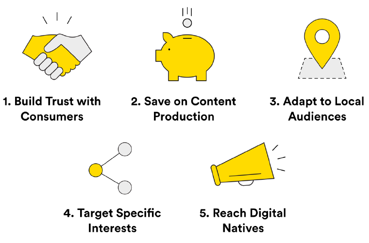
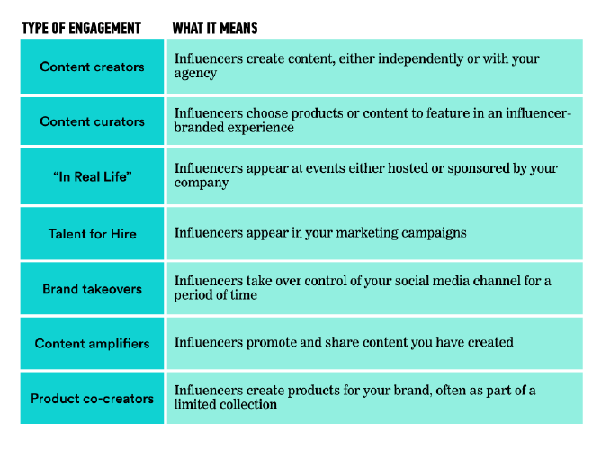

##### INTRO TO INFLUENCER MARKETING
# Lesson 1 Review Guide

*What is Influencer Marketing?*

Influencer marketing is the practice of engaging people with social influence to promote your
brand.  

### Influencer marketing has a role in paid, earned, AND owned media. 

- Paid media: For a fee, those who have built up a significant social media following will
promote your brand by creating content, promoting it, and/or appearing at events. 
- Earned media: Unpaid influencers, or brand advocates, will do the same but without
compensation because you have created content or a product that they truly love and
want to share. 
- Owned media: Whether or not you have paid an influencer, you might use influencer-
created content in your brand’s channels. For example, you could use an influencer’s
photos on your website or re-post their content on your brand’s social media channels. 

### Five key benefits of influencer marketing:

### Remember…

Influencer marketing requires giving up some creative control to the influencer in order to
maintain authenticity.

### Type of Influencer Marketing Engagements:

