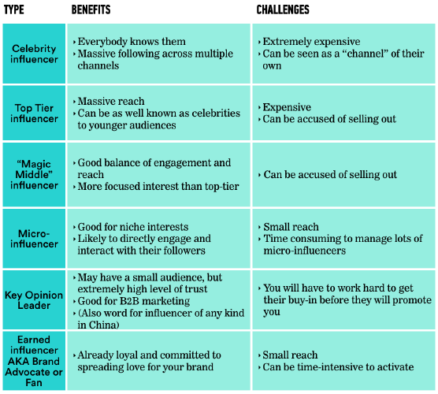
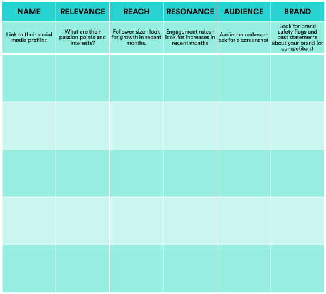

###### Influencer Marketing
# Decision Guide: Choosing and Activating Influencers

| Lesson Assets    |
| ---------------- |
| [assets](assets/) |

----------------------------------
### Lesson + Instructor Info

_Lesson Title_: Decision Guide: Choosing and Activating Influencers

_Duration* (minutes)_:  25

### Summary Messages

##### Topics
- What kind of influencer should I engage?
- How do I choose the right individual influencers for my campaign?
- What kind of agency or partner should I work with?

##### References & Next Steps

_Further Study_:
Choosing the right influencers to work with is both the most challenging and most important part of an influencer campaign.

Because influencer marketing is so human- and relationship-oriented, it can be easy to fall in love with influencers who might not be a good fit for your brand. Use the frameworks we’ve shared to guide a non-emotional evaluation.

- Check out [Adweek’s article](www.adweek.com/digital/micro-influencers-are-more-effective-with-marketing-campaigns-than-highly-popular-accounts/) on why many brands find micro-influencers more effective than celebrity or top-tier influencers.
- Read Max Chafkin’s [Confessions of an Instagram Influencer](https://www.bloomberg.com/news/features/2016-11-30/confessions-of-an-instagram-influencer) to take a journalistic look at the journey from regular person to micro-influencer.  
- If you’re looking for a tool, this article reviews some of the most popular [influencer marketing platforms](www.business2community.com/brandviews/content-blvd/popular-influencer-marketing-platforms-reviewed-01549843#MgeAktmCs5RQhQc1.97). You can find a more comprehensive list of more than 130 platforms [here](theinfluencemarketer.com/133-influencer-marketing-agencies-platforms-tools-companies/).

----------------
### Slideshow
<!-- 1 -->
_Slide Title_: Decision 1: What Kind of Influencer Will You Use?

Simply put, an influencer is someone who carries influence over an engaged audience. If you think about who influences you, it might be anyone from your favorite movie star, to your college professor, to your best friend.
There are multiple tiers of influencers. People define the tiers differently, but here are some guidelines:

---
<!-- 2 -->
_Slide Title_: Celebrities

Celebrities are the influencers we’re most used to seeing in marketing. Unlike other influencers, celebrities have generally earned their fame in music, movies, TV, or sports — and have gathered a massive social following as a result of that fame. Celebrities often have tens of millions of followers.

You probably won’t find celebrities on an influencer platform or through a multi-channel network (MCN). Instead, you’ll likely need to work with their talent agency, much like you would with a traditional celebrity endorsement.

Because celebrity influencers are media channels in and of themselves, influencer marketers often question whether celebrity engagement leads to a lasting connection to your brand. These partnerships are also the most expensive, regardless of the results.

---
<!-- 3 -->
_Prompt_:How much was celebrity influencer Kim Kardashian paid to attend the Revolve Hamptons fashion party for one hour in 2016?

_Choices_:
1. $50,000
1. $300,000
1. $700,000 *
1. $1,000,000

_Explanation_:
That’s right — which works out to a whopping $12K a minute. It pays to be a Kardashian!

Image source: http://talkingwithtami.com / BFA

---
<!-- 4 -->
_Slide Title_: Top-Tier Influencers

Top-tier influencers differ from “celebrities” because of the nature of their fame — their stardom was born on the internet.
These Internet sensations, such as PewDiePie, Xiaxue, or Jenna Marbles, entertain or inspire admiration in their audiences, often amassing follower counts that rival those of celebrities.

Image: superfame.com
---
<!-- 5 -->
_Video Link_: https://generalassembly.wistia.com/medias/itxhv384mz

_Video Transcript_:
“The world’s top influencers are totally overwhelmed with brand opportunities. It’s just the reality. Every day, they probably get 10 different brands coming to them for deals.

There’s a supply-and-demand disconnect at the moment, and influencers are able to pick and choose who they want to work with. And they do. They should be — and can be — very picky. And the reason for that, in a large part, is because their audience literally will call them out in the comments and underneath the branded content if it doesn’t feel like an organic fit.

The best thing to do is to find an influencer who is already using your product natively and organically, and partnering up with them, rather than coming in and paying them to use a brand that they’ve never heard of — that they don’t particularly like, and they’re just doing it for the check.

The most amazing campaign was when we used an influencer who had never been used by a brand before. We used her for a telecommunications brand. And the comments in the box underneath were so supportive and so — almost proud that this influencer that they’d be following for five or six years suddenly got a brand deal with one of the world’s largest cellphone companies. It was all comments like ‘Good for you,’ ‘I’ve been supporting you for five, six years,’ ‘I know you’re an emerging filmmaker and now you have a brand sponsoring you,’ and ‘The way that you have created this content for the brand is content that you’d be creating anyway.’

That’s the sweet spot. That’s where you want to get at.”

---
<!-- 6 -->
_Slide Title_: “The Magic Middle”

The middle tier of influencers falls between the top-tier and micro-influencer groups. Some influencers in this tier have 1 million followers, while others have only 100,000.

For these individuals, creating content for a brand is still secondary to their full-time profession. They tend to post sponsored content less frequently than social celebrities do, and their posts may be seen as more genuine.

The majority of influencer campaigns focus on this tier. So what makes the middle “magic”? These influencers have both the reach and the engagement to justify the marketing cost.

If you find a magic middle influencer on an upward trajectory, you can luck out and lock in a relationship that grows in value as their audience grows in size.

---
<!-- 7 -->
_Video Link_: https://generalassembly.wistia.com/medias/x39rcq17pd

_Video Transcript_:

“The magic middle of influencers are those folks that have a little bit smaller audiences, but they’re the ones that actually have grown with them the entire way. They’re very loyal, they listen, they’re truly engaged, and they likely are going to be spreading word of mouth from what they learned from their friend.

I would say a lot of these magic middle influencers think of their audiences as friends, because they’re still communicating, they’re still talking back and forth to one another. That is a sweet spot, because not only are you getting that influencer sharing something with an audience who truly, truly believes them, but that audience is likely to talk to their friends a little bit more because they feel like a friend is actually giving them that advice.”

---
<!-- 8 -->
_Slide Title_: Micro-Influencers

Different agencies have different definitions of “micro-influencers” (so be sure to ask), but in general, these influencers have audiences of 5,000–100,000 followers.

Micro-influencers are particularly good for campaigns targeting a niche audience or as a “long tail” for a large campaign.

Some influencer marketers find that there is an inverse ratio between follower count and engagement, so micro-influencers can actually be more effective for engagement-focused campaigns.

Additionally, while top-tier influencers are more likely to be accused of “selling out,” fans are often supportive when they see micro-influencers land a brand sponsorship.

---
<!-- 9 -->
_Slide Title_: Earned Influencers

Earned influencers are also known as unpaid influencers, brand advocates, or fans.

These individuals do not necessarily have a large online following but are more determined than any other category of influencer to share your brand with their friends and family.

To maximize the potential of this group, you might identify the top 10 percent of your earned influencers — people who are already talking about your brand online — and engage them with “surprise and delight” tactics, such as:

 - Invites to brand events.
 - A community channel or group for them to connect with each other and your brand.
 - Exclusive first looks at new products and promotions.

This fosters greater brand advocacy and also creates a sense of exclusivity.

For example, GoPro is known for their incredible user-generated content, so the company built a dedicated page for compiling this content. Now, content creators and brand advocates alike try to get their videos on the website, building excitement and exclusivity around being a fan.

---
<!-- 10 -->
_Slide Title_: A Tale of Earned Influence: An Oldie, But a Goodie:

Back in 2011, Peter Shankman, an angel investor with more than 100,000 followers on Twitter, casually tweeted at Morton’s Steakhouse before he boarded a plane home from a business trip, asking it to meet him at Newark Airport with a steak.

To his surprise and delight, Morton’s sent a tuxedoed driver from the nearest restaurant — 24 miles away — steak in hand.
By showing gratitude to Peter, a longtime fan and brand advocate, Morton’s generated true brand love — as well as an enormous amount of earned media.

---
<!-- 11 -->
_Slide Title_: Key Opinion Leaders

Key opinion leaders (KOLs) are influencers in pharmaceutical and B2B marketing (Note: in China, the same term is used to describe an influencer of any size).

Influencer marketing in a B2B context tends to revolve around thought leadership, whitepapers, niche bloggers, authors, and publishers. Twitter, LinkedIn, and blogs are common channels for leveraging KOLs.

Because these individuals have spent years — if not decades — developing their reputation and social capital, they’re not likely to hawk a product or company they don’t believe in. You’ll need to be thoughtful in your approach, closely align your content/event/product with something they’ve expressed a passion for, and showcase how a partnership will provide value to their audience.

---
<!-- 12 -->
_Slide Title_: Influencer Types at a Glance: Pros and Cons

---
<!-- 13 -->
_Video Link_: https://generalassembly.wistia.com/medias/hec93ozzvz

_Video Transcript_:

---
<!-- 14 -->
_Slide Title_: Decision 2: Which Influencers Are Best for Your Campaign?

We’ve covered what influencer marketing is and why your brand needs it. There are obvious benefits to this type of marketing — but only if you work with the right influencers.

It’s tempting to use a single metric to measure an influencer’s effectiveness, such as aggregate follower count, but that’s only part of the picture.  

Start with the three essential factors of relevance, reach, and resonance.

---
<!-- 15 -->
_Slide Title_: The First “R” — Relevance

If you engage an influencer with an audience in the millions, yet only 5 percent of this audience finds your brand relevant, will your campaign be successful?

Probably not — which is why first and foremost, you must determine whether the influencer is a contextual fit. This is the single-most important characteristic to consider when finding influencers. It’s also the one that takes the most work to evaluate.

Take a close look at the content the influencer has created and shared to assess its relevance to your business and the particular market segment you want to target. You should be able to tell at a glance if you’re on the right track.

From there, you can dig deeper by auditing the influencer’s audience. Identify 5–10 of the most engaged audience members, and look at their profiles and interests. If this is your ideal target, you’ve found a match!

---
<!-- 16 -->
_Video Link_: https://generalassembly.wistia.com/medias/81nvfxj94m

_Video Transcript_:
“When we approach brands to work with them, we’ll typically talk about ‘passion points.’ An influencer typically focuses on one or two passion points in their content type or their content territory. Gaming is a passion point, beauty and fashion is a passion point, unboxing is a huge, huge, huge area in what we call a passion point, technology, mommy vloggers, travel influencers…

So really, figuring out whatever the passion point of the influencer is and what content type they create around it — if your brand operates in that same passion point it’s a pretty endemic and natural fit.

Sometimes you might want to work with an influencer who is in a totally different passion point — if you’re looking to target a different audience segment, or if you’re trying to build awareness with a group who typically wouldn’t be that interested in your brand naturally.

A good example is we worked with a big technology influencer, and we sent this technology influencer to an auto company’s premises and we had this tech YouTuber interview an automaker CEO to create content that lived on her channel. You wouldn’t necessarily think of it as immediate fit, but it worked. Sometimes you can go out of the passion point, and that’s OK, too.”

---
<!-- 17 -->
_Slide Title_: Relevance: Where Do Your Stories Intersect?

Influencers and creators have “passion points,” or areas of expertise and topics they love to talk about. When your brand story intersects with an influencer’s passion points, and when the influencer has an authentic appreciation for your brand — that’s when the magic happens!

---
<!-- 18 -->
_Slide Title_: The Second “R” — Reach

“Reach” is an influencer’s total number of followers or subscribers.
Prioritize this metric if you’re working on a campaign in which exposure is your highest priority. But be forewarned — a large follower count does not automatically lead to a successful campaign.

There are countless examples in which influencers with large audiences were outperformed by “smaller” influencers because of a misguided focus on big numbers, instead of how the content would resonate with the follower base.

You will want to dig into the make up of the influencer’s followers. The importance of good audience data can’t be emphasized enough. It’s great if you have a highly popular influencer, but if 75 percent of their audience members live in a country where your product is not available, you’ve just wasted your money.

You can — and should — ask for screenshots of the influencer's audience insights. You can use that data to determine which audience segment the influencer is most attuned to and plan your campaign accordingly.

---
<!-- 19 -->
_Slide Title_: The Third “R” — Resonance

“Resonance” is the influencer’s ability to inspire their audience to take action.
This is often measured by engagement, including:
- Likes
- Shares
- Comments


Of course, you may be looking to drive actual purchases. This information is less readily available outside the confines of a campaign, but you can ask the influencer or agency for past performance related to:
- Purchases
- Registrations
- Redemptions of coupons/promos
- Click-throughs/traffic driven to sites

For videos, you’ll want to ask about view-through rates:
- What percent of their “views” are completed views (i.e., viewers watched the whole video)?
- Is there a difference in view-through rates for branded and organic content?

---
<!-- 20 -->
_Slide Title_: Fake It Till You… Don’t Make It

Be aware that these qualities can be faked by those looking to make a career (or at least some quick cash) as an influencer.

It’s possible for individuals to buy followers or use automated follow-back tools to rapidly grow their audience. These followers are unlikely to continue following and tend to have very low engagement rates.

Spotting fake relevance:

- Influencers can use automatic posting tools to keep their feeds populated. Watch out for influencers who post much more frequently than their counterparts and who lack a personal message or common theme with their posts.

Spotting fake reach:

- Watch out if a follower base seems to lack a common theme. Additionally, check the ratio of following to followers; a real influencer has many followers and follows relatively few.

Spotting fake resonance:

- Automated tools can also create comments and shares. Look at the quality of the comments and shares — do they drive genuine conversation or are they just noise?

---
<!-- 21 -->
_Video Link_: https://generalassembly.wistia.com/medias/au34ltw0ls

_Video Transcript_:
“There’s a lot of buzz in the industry at the moment about live video — Facebook Live and Instagram Live. What we’re seeing is sometimes the influencers who’ve built their success on YouTube through editing and Photoshopping of content, sometimes they don’t work as well when it comes to live platforms.

So, what we’ve found working with brands who want to play with influencers when it comes to live, we’ve had to go and find influencers who we haven’t worked with the past because they don’t necessarily have the same spark online when it comes to live. They can’t react to the moment. It can be very highly pressurized.

We tend to give some sort of a suggested script or talking points to make sure that the brand’s notes are being taken into account and the campaign is mentioned in the correct way. It can be risky doing anything live. That’s why it’s so important to vet out influencers who have a pedigree of creating content for a live audience.”

---
<!-- 22 -->
_Slide Title_: Other Considerations

- Are they on an upward trajectory? If an influencer’s relevance, reach, or resonance is declining, you may get disappointing results when the campaign launches.

- What is their release cadence? For instance, do they post every Tuesday and Thursday afternoon? Do you need your posts published at particular times and dates, and will your content work with their standard cadence?

- What have they said about your brand in the past, if anything?

- What have they said about your competitors?

- Influencer diversity is important. When working with multiple influencers, include a variety of follower counts, content styles, and diverse audiences. This will help limit overlap, as similar influencers are likely to have the same fans. You might balance some who have higher reach with others who have a smaller reach, but more active followers.

---
<!-- 23 -->
_Slide Title_: Influencer Comparison Chart

---
<!-- 24 -->
_Slide Title_: Decision 3: Should I Engage an Agency or Platform?

The surge in influencer marketing has spawned a variety of platforms and providers that aim to help brands navigate this emerging sector.

Identifying which influencer marketing partner to work with is the second-biggest challenge of influencer marketing, according to a 2017 Linqia survey.

You have a few options in this matter:

- Engage your media, digital, or PR agency.
- Engage an influencer network or multi-channel network.
- Engage a publisher.
- Use an influencer platform.
- Do it on your own.

---
<!-- 25 -->
_Slide Title_: Activating Through Media or PR Agencies

When influencer marketing through social media first began to gain popularity, it was often handled by PR agencies.

Even today, when there are a multitude of influencer-specific networks, agencies, and platforms to choose from, running an influencer campaign through a PR or media agency does have advantages. It is simpler to manage your various marketing and communications activities through a single entity.

Additionally, if you’re looking for a one-off experiment, this is a good way to get your feet wet without investing in a new partnership.

---
<!-- 26 -->
_Slide Title_: Activating Through Influencer Networks/MCNs

Brands can also work with influencer networks or multi-channel networks (MCNs) that represent thousands of influencers.

MCNs and influencer networks provide full-service campaign management to clients. They serve as one-stop shops for influencer outreach, contracting, and management. They can also help you boost your campaign with live event production, custom branded content, amplification through paid media, and real-time optimization of the campaign.

If you choose an influencer network or MCN, you’ll also get the benefit of working with people who do this day in and day out and can provide advice on legal and financial matters.

These solutions work well for large brands that are looking to activate influencers at scale.

---
<!-- 27 -->
_Slide Title_: Activating Through Publishers

Many publishers are adding depth and breadth to the products and services they offer to brands in order to capture more budget and reach more parts of the funnel.

Publishers feature writers, creators, and personalities who bring many users to their sites. Publishing companies can leverage these influencers on behalf of their clients.

For example, a media agency might buy inventory on Refinery29’s website and its network of owned-and-operated sites and shows. To sweeten the deal, Refinery29 may grant the media company access to influencers as added value to increase the deal size.

---
<!-- 28 -->
_Slide Title_: Activating Through Influencer Platforms

There are a multitude of platforms that make it easy for brands to handpick and reach out to online stars. Working with such platforms can significantly speed up the process of executing your influencer campaigns.

Each platform is different, but many allow you to choose influencers, connect with them, offer opportunities to work with your brand, negotiate deals, and approve content before it is uploaded, as well as track specific metrics and goals.

We won’t attempt to name all of these platforms, but this site has a description of more than 130 in the marketplace. Some of our contributors’ favorites include Little Bird, Onalytica, Klout, TRIBE, InfluencerDB, TapInfluence, GroupHigh, Social Blade, SocialEdge, Playa, and Traackr.

These solutions work well for brands that work frequently with influencers, as well as for campaigns with limited budgets.

---
<!-- 29 -->
_Slide Title_: Doing It on Your Own

If you work for a smaller company, have a smaller budget, or want to work with a specific influencer, you might reach out directly.

If this is your approach, you’ll need to double down on building a good relationship and first impression from the start.
Some tips for your first outreach:

1. Don’t start with “I.”

Focus on the person you’re writing to — do your research. Read their blog thoroughly, find out what makes them tick, and focus on creating a personal connection. Do they have a dog? Comment on that. Do they have the same name as you? Use that.

2. Build a relationship.

Before reaching out to an influencer, take the time to familiarize yourself with their social channels. Follow them and leave some comments. Engage with them so that when you reach out to them, they already know who you are and will be more likely to reply.

3. Do not use templates!

Influencers will notice your template from a mile away, so please try and avoid using the same format as everyone else for your outreach efforts.
Use their first name in the subject header and make sure you focus on the advantages a partnership will have for the influencer (e.g., remuneration/free product/attending an event). And make sure to keep it short. You’re trying to get their attention first and foremost; you can hash out the details at a later stage.

---
<!-- 30 -->
_Video Link_: https://generalassembly.wistia.com/medias/6rfpduhitl

_Video Transcript_: “When working with an influencer, a brand always has to remember that they’re a human being, right? It’s not a programmatic ad buy. You’re working with someone who’s got dreams and has got their own personality. Sometimes they can be divas to work with, and sometimes it can be challenging. The results tend to be great, but the process can be difficult from time to time.

The way to work best with an influencer, from a brand safety perspective, is typically to work with an influencer network or a multi-channel network through your agency of record to find the right talent — to find the talent who are safe for brands, to find the talent who are responsive in the comments, to find the right influencer who has worked effectively with brands in the past. Those are some of the ways to make sure that the content that that’s being created by the brand is effective, but it also aligns with the brand values in which you operate.”

---
<!-- 31 -->
_Slide Title_: Agency Types at a Glance: Pros and Cons

---
<!-- 32 -->
_Slide Title_: Questions to Ask When Evaluating Your Agency/Partner:

We’ve given you some criteria to decide what kind of agency to work with, but you may also want to compare contenders before entering a partnership. Here is a list of questions to help you evaluate a potential partnership:

About the agency:

- What have you done for other companies in our space, and what results can you point to?
- What is your process for matching brands with influencers?  
- What are your audience targeting options, and where does this data come from?
- How do you facilitate communication between the brand and influencer (and how many parties sit in between)?
- Who will manage the program and correct issues as they arise?
- How many brand reviews will I be allowed?

About their influencers:

- How do you find and establish relationships with influencers?
- How do you identify and deal with influencers who are gaming the system?
- Can you compare engagement, reach, scale and performance metrics per influencer?
- Can you access historical data to determine whether the influencer is growing or shrinking in popularity?
- Can I easily view what brands influencers have worked with or mentioned in the past?

About their reporting:

- What are our options for measuring the campaign? Will any of them have an added cost?
- Can you share a screenshot of your analytics?
- Can you share a sample report?
- Is reporting available on the platform, or through spreadsheets?
- Do they provide real-time reporting on influencer and content performance?

---
<!-- 33 -->
_Video Link_: https://generalassembly.wistia.com/medias/7l0mpxa0mp

_Video Transcript_:
“A question I might ask to an agency when vetting a campaign with them is to truly show me some of their work and also ask them exactly what the impact was. Be careful of all those vanity metrics, how many views it got, how many likes it got — who cares? Make sure that they actually said ‘this increased sales or ‘in a post-survey study we know we surveyed one hundred 13-year olds and they all like the brand much better.’ Something like that.

And read some of those comments, go on YouTube. If you’re about to work with an agency that you’re unsure of, or you want to know more about, go and see what the audience said. Go read all the comments on YouTube underneath their work. Go look at Facebook and see where it was shared and how it was shared. Go see how it was truly received, not just from a media standpoint, but how the audience actually reacted to it.”
---
<!-- 34 -->
_Slide Title_: Sweet!

You’ve learned another skill on the influencer marketing honeycomb.

---
