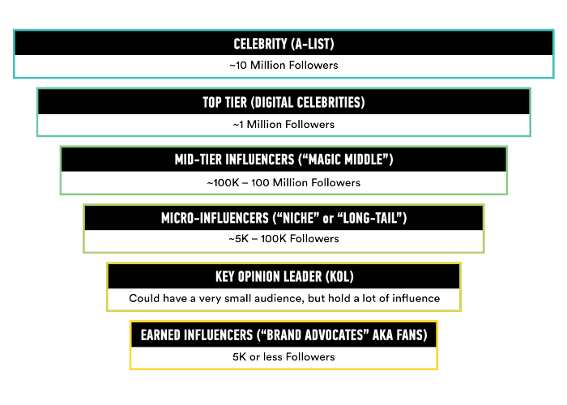
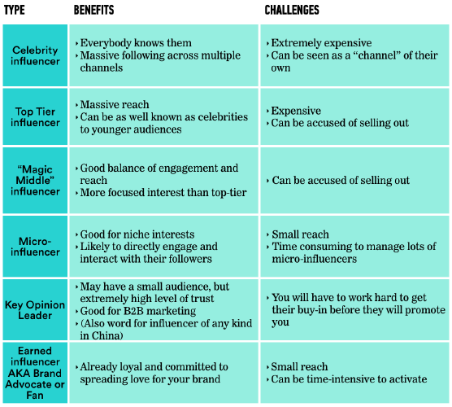
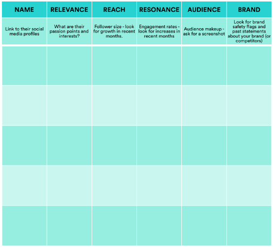

 #DECISION GUIDE: CHOOSING INFLUENCERS

###What kind of influencer will you use?

### Which influencers are best for your campaign?
1. Relevance
- Take a close look at the content the influencer has created and shared to
assess its relevance to your business and the market segment you want to
target.
- When your brand story intersects with an influencer’s passion points —
that’s when the magic happens! 

2. Reach
- Prioritize this metric if you’re working on a campaign in which exposure is
your highest priority.
- Be aware that a large follower count does not automatically lead to a
successful campaign!

3. Resonance
- The influencer’s ability to cause their audience to take action, measured by
their engagements, including:
   - Likes
   - Shares
   - Comments

### Remember…
That all of these qualities can be faked by those looking to make a career (or at least some quick
cash) as an influencer.

### Comparison Chart:

### Influencer Marketing Partners:

### Questions to ask when looking for an agency or partner:
- About the agency: 
   - What have you done for other companies in our space, and what results can you
point to?
   - What is the process for matching brands with influencers?  

   - What are your audience targeting options, and where does this data come
from? 
   - What’s the process for the brand to communicate with the influencer (and how
many parties sit in between)? 
   - Who will be managing the program and correcting issues as they arise? 
   - How many brand reviews will I be allowed?
- About their influencers: 
   - How do you find and establish relationships with influencers? 
   - How do you identify and deal with influencers who are gaming the system? 
   - Can you compare engagement, reach, scale and performance metrics per
influencer?
   - Can you see historical data to determine whether the influencer is growing or
shrinking in popularity? 
   - Can I easily view what brands influencers have worked with or mentioned in the
past?
- About their reporting: 
   - What are our options for measuring the campaign? Will any of them have an
added cost? 
   - Can you share a screenshot of your analytics? 
   - Can you share a sample report? 
   - Is reporting available on the platform, or through spreadsheets? 

### Platforms

If you’re looking for a tool, this article reviews some of the more popular [influencer marketing platforms](http://www.business2community.com/brandviews/content-blvd/popular-influencer-marketing-platforms-reviewed-01549843) , and you can find a more comprehensive list of over 130 platforms [here](http://theinfluencemarketer.com/133-influencer-marketing-agencies-platforms-tools-companies/).
