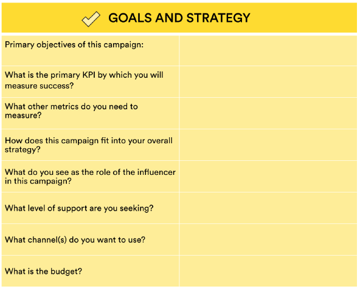
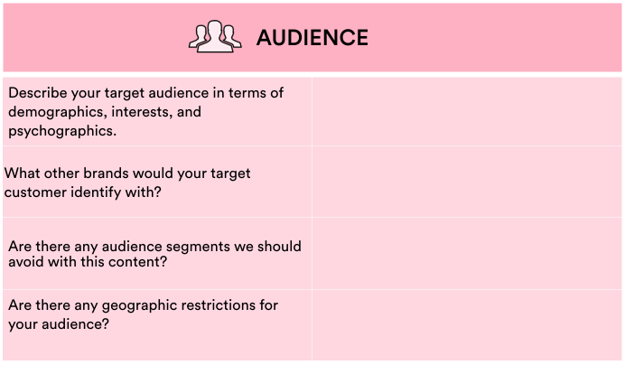
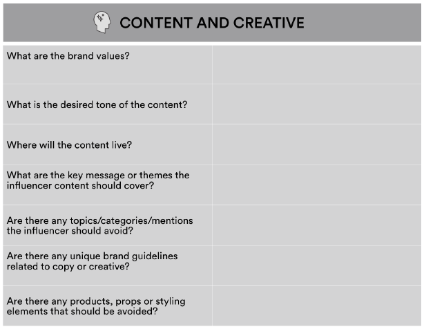
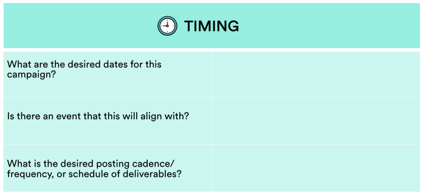
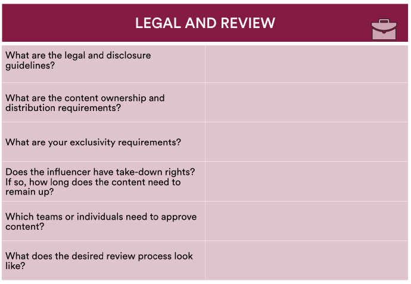
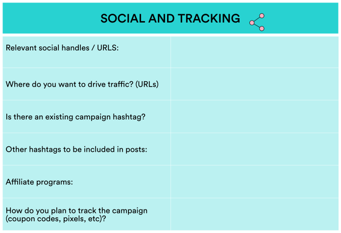
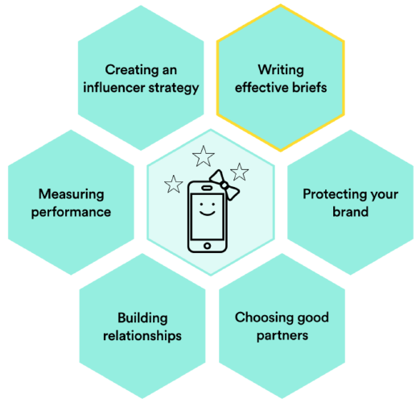

###### Influencer Marketing
# Creating an Influencer Campaign Brief

| Lesson Assets    |
| ---------------- |
| [assets](assets/) |

----------------------------------
### Lesson + Instructor Info

_Lesson Title_: Creating an Influencer Campaign Brief

_Duration* (minutes)_:  15

### Summary Messages

##### Topics

- Why you need a brief.
- What to cover in a brief.
- A brief template.
- Pro tips on briefs.

##### References & Next Steps

_Further Study_:
Use a campaign brief to avoid any misunderstandings, clearly set expectations, and share legal and review requirements. This will set you up for achieving your goals while building a strong relationship.
- Scrunch.com offers [further advice on briefing influencers](https://scrunch.com/blog/briefing-influencers/).
- Bit.ly shares a [simple template](https://scrunch.com/blog/briefing-influencers/) for reaching out to individual influencers.
- Andrey Zhuravlev shares an [example of a real](https://www.linkedin.com/pulse/sample-influencer-brief-andrey-zhuravlev) brief used for a new Dyson vacuum cleaner on LinkedIn.

---
<!-- 1 -->
### Slideshow

_Slide Title_: Setting Your Campaign Up for Success

Once you’ve established a connection with the agencies or influencers you want to collaborate with, you need to provide them with a brief.

A comprehensive brief will help provide clarity and avoid potential pitfalls. There is nothing more frustrating or embarrassing than an influencer suddenly backing out of an agreement because the campaign, legal, or ownership requirements weren’t clearly stated.

---
<!-- 2 -->
_Slide Title_: Who is Responsible?

When crafting the campaign brief, there is a fine line between providing enough guidance and micromanaging. An exceptional campaign brief will provide clarity around the project while still allowing the influencer the creative space to stay true to their voice and authentic to their audience.

The marketing manager directing the campaign should create the brief, then get approval from the their supervisor and the legal department. If you’re working on behalf of a brand or another department, it’s crucial to receive the approval of those stakeholders as well.

---
<!-- 3 -->
_Video Link_: https://generalassembly.wistia.com/medias/5zbhp10mps

_Video Transcript_:
“If you’re doing influencer marketing for the first time, what I would say is set your expectations clearly with your agency of record about what the objective is of the brand and about what their KPI is for this brand campaign. It’s always good to go with a very clear brief.

That brief should have questions and answers in there around what’s the objective and KPI of the campaign, what’s the flight time, what months and days should the campaign be live, when should the influencer upload the content. You should be putting in budget parameters in the brief, you should be putting in top-line strategy, as well as suggested tactics. You should be putting in preferred platforms — do you want the influencer to create content on YouTube, Facebook, Instagram, Twitter, or across the entire social graph? Do you have a preference for long-form or short-form content?

And you should also, and most importantly, be leaving almost a big white space for the influencer to come back to you with creative ideas and a creative strategy about what they think would work for their format and what they think would work for their audience.”

---
<!-- 4 -->
_Slide Title_: The Brief Template

This lesson provides a brief template for an influencer campaign. We will walk you through each section of the brief.
While not every field of this brief might be relevant for your campaign (and there may be others you want to include), working through this process will help you think through your campaign and align your team internally before approaching an agency or influencer.

[Download PPT template](InfluencerBriefTemplate.pptx)
---
<!-- 5 -->
_Slide Title_: Section 1: Goals and Strategy

Before getting started, brands should understand why they are using influencers. They should clearly define their objectives and identify the KPIs they will use to measure success.  

If your objective is to find long-term influencer partners, be sure to include a note stating this. Influencers, like all freelancer, are always on the lookout for stable, long-term partnerships that can provide dependable income.

---
<!-- 6 -->
_Video Link_: https://generalassembly.wistia.com/medias/lnefgp3vfq

_Video Transcript_:
“A way that I like to approach my campaigns is tease, anchor, amplify. So having the content teased out on certain platforms to drive to an anchor video or piece of content — maybe it’s on YouTube — and then amplify it on other platforms.

Have the influencer consider the content that way as well, and you’ll typically get more bang for your buck.”

---
<!-- 7 -->
_Slide Title_: Section 2: Audience

In your planning, don’t fall in love with specific influencers too early on. Flexibility in talent selection is key, as it will depend on scheduling, availability, and the interest of the influencer.

Instead of thinking “influencer first,” think “audience first.” Look at the audience data for your prospective influencers to make sure they resonate with the demographics your brand is targeting.

Note that technology has enabled influencers to have international footprints, no matter their geographic location. If your campaign is targeted at a Russian audience, for example, you can still use a talent based elsewhere if they have a large Russian following.

---
<!-- 8 -->
_Video Link_: https://generalassembly.wistia.com/medias/c5stsji1yq

_Video Transcript_:
“One best-practice piece of advice is ‘always look at influencer marketing from an audience-first perspective instead of an influencer-first perspective.’

Just because an influencer lives in Los Angeles doesn’t necessarily mean that their audience is in the states. So if your brand is targeting only the U.S., you need to look at where the audience of the influencer is as well — what the gender breakdown is of the audience, what the geographic breakdown is, what the percent of a population is based in the states, certain parts of the states, versus other countries.

That’s really, really important, because when the influencer uploads their content to their channels, if 80 percent of their audience are based in Europe and you’re targeting the U.S., there would be a lot of wastage in that. That’s why we always approach briefs through the lens of audience first.”

---
<!-- 9 -->
_Slide Title_: Section 3: Content and Creative

Content creators know their audiences and what resonates with them better than anyone — listen to them and trust their instincts. Always look for alignment of passion points between the brand and the influencer, and aim for a fine balance of brand integration and authentic, organic creator content.

Include detailed information relating to tone, use of branded imagery, and styling elements. If possible, include visual examples as well as an explanation of what you would ideally like. But refrain from trying to create the content for them. Influencers will not respond well to too much micromanagement, and there is nothing more transparent than a social influencer regurgitating brand-approved copy.

---
<!-- 10 -->
_Slide Title_: Section 4: Timing

Influencers may be booked with other campaigns or just busy with their personal and professional lives, so a schedule is essential. Custom content could require 6–8 weeks, so plan ahead!

You can keep this part broad at first and settle on a final schedule of deliverables after conversations with the influencer. But be sure to set clear expectations by providing timelines and due dates when the final agreement is signed. If necessary, include penalties if the influencer is behind schedule.

---
<!-- 11 -->
_Slide Title_: Section 5: Legal and Review

Include all regulatory compliance information (i.e., FTC or ASAS). Don’t assume the influencer knows this already. Be clear about legalities and let them know you’ll be checking all of their content for the requisite disclosures (i.e., using #ad or #sponsored when necessary).

Include very clear information regarding content ownership and distribution rights. This is one of leading causes of misunderstandings between influencers and brands.

If an influencer does not want to relinquish rights to their content, there is always a possibility to negotiate with them. If they’re not willing to accept your terms, cut them loose and find a better candidate for your campaign. It’s not worth the headache.

---
<!-- 12 -->
_Slide Title_: Section 6: Social and Tracking Links

Include information on your brand’s own social reach, and, if applicable, how you will amplify the influencer’s reach with a paid campaign. This will entice influencers all the more.

Influencers often partner with affiliate link companies (rewardStyle, Amazon Affiliate Program, etc.) to further monetize their posts. Will you allow influencers to use affiliate links in their blog posts and social posts where it makes sense to do so?

You may plan to track the campaign with coupons, promos, pixels, or UTMs. You may not have those set up already, but you can indicate your plans here.

---
<!-- 13 -->
_Slide Title_: Parting Advice

We shared a brief template in this lesson, but you don’t necessarily need to have all the answers before you share it. Your partner may be able to help guide your strategy, and you may need to add or remove some sections depending on who you are approaching (agency or influencer).

If you have sections that are lengthy, such as the brand guidelines or legal guidelines, you can include hyperlinks to those documents online. This will allow you to share the brief in a concise format (and not scare anyone away!)

---
<!-- 14 -->
_Slide Title_: Sweet! 

You’ve learned another skill on the influencer marketing honeycomb.

---
