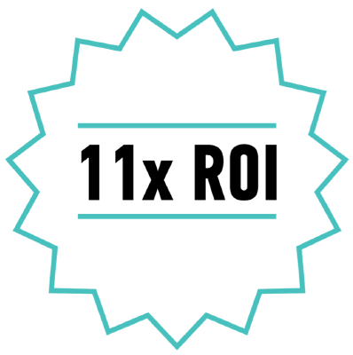
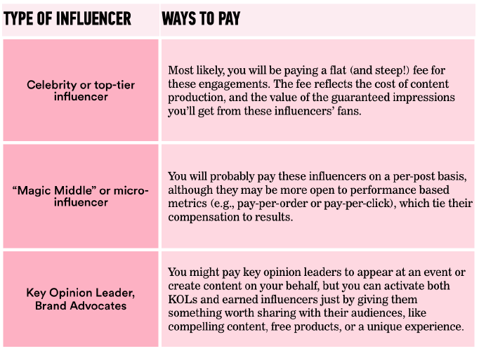
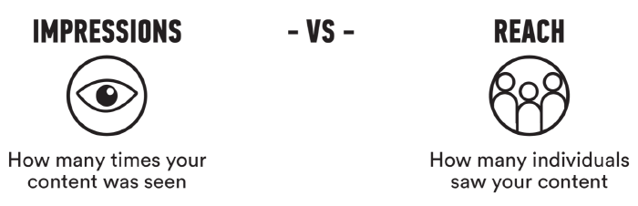
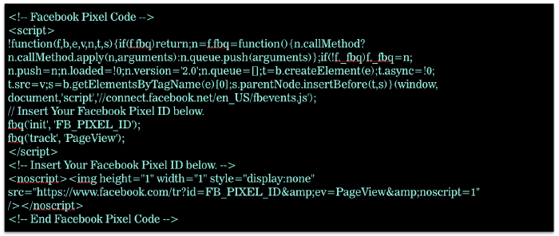
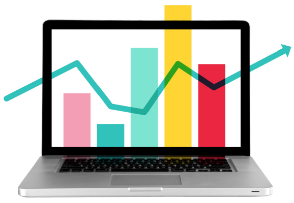
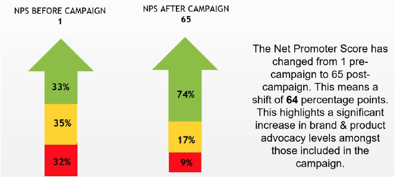
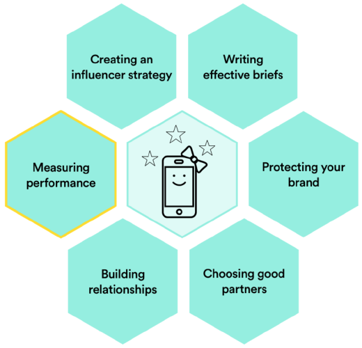

###### Influencer Marketing
# Measuring Your Influencer Campaign

| Lesson Assets    |
| ---------------- |
| [assets](assets/) |

----------------------------------
### Lesson + Instructor Info

_Lesson Title_: Measuring Your Influencer Campaign

_Duration* (minutes)_:  20

### Summary Messages

##### Topics

- Measuring ROI.
- Costs of an influencer campaign.
- Measuring awareness.
- Measuring engagement/interest.
- Measuring conversions.

##### References & Next Steps

_Further Study_:

Measuring the success of an influencer campaign is challenging but not impossible. Do your homework to understand the costs and possibilities for measurement at the outset of the campaign.

- Read Digiday’s research into the [costs of an influencer marketing campaign](https://digiday.com/marketing/what-influencer-marketing-costs/).
- Review Linqia’s report [The State of Influencer Marketing 2017](www.linqia.com/wp-content/uploads/2016/11/The-State-of-Influencer-Marketing-2017_Final-Report.pdf), which shares average costs, benefits, and challenges of influencer marketing, based on a marketer survey.

--------------
<!-- 1 -->
### Slideshow

_Video Link_: https://generalassembly.wistia.com/medias/nkg99nxma9

_Video Transcript_:
“The biggest pain point at the moment, when working with influencers, is probably the actual talent selection. Trying to search, discover, identify, the right talent out there. There are hundreds of thousands of influencers at the moment and how do you distinguish between them? You’ve got celebrity, you’ve got top-tier talent, you’ve got the up-and-comers, you’ve got the micro-influencers. It can be very, very, difficult to find the perfect fit from a tonality perspective for your brand, so that’s one pain point. Then the second pain point is measurement. Actually proving the effectiveness of an influencer marketing campaign versus the other media in your marketing mix, versus TV, print, out-of-home, radio. Really trying to isolate the influencer’s activity and what it’s done for brand effectiveness, or for sales — that can be a challenge which the whole industry is trying to figure out at the moment.”

---
<!-- 2 -->
_Slide Title_: So, You Spent Some Money on an Influencer Campaign…

As a marketer, you need to be able to quantify the success of your campaigns. Tracking and measurement can help you determine your campaign’s return on investment (ROI).

In practice, measuring ROI for an influencer campaign can be pretty tricky. The next few slides delve into an influencer campaign for Silk, a dairy substitute brand. The campaign had an ROI of 11x. Pay special attention to all the measurement that went into calculating Silk’s ROI.

---
<!-- 3 -->
_Slide Title_: Silk’s “Meatless Monday” Influencer Campaign

Looking to solidify its place in the health food world, Silk created an influencer campaign with influencer agency TapInfluence in 2015. The campaign, which encouraged audiences to celebrate “Meatless Monday,” featured blog posts and vegetarian recipes from more than 250 top fitness and food influencers.
At that time, few had attempted to study the offline sales impact of influencer marketing in a rigorous way. TapInfluence wanted to change that. The company partnered with Nielsen Catalina Solutions (NCS), a measurement vendor that specializes in linking the media people consume online to the products they buy offline.

---
<!-- 4 -->
_Slide Title_: Measuring Silk’s Campaign, Pixel by Pixel

Silk would have definitely seen some profit even if it hadn’t run its campaign, so TapInfluence couldn’t just assume that all of Silk’s profit during “Meatless Monday” was due to the campaign. To isolate the impact of the campaign, TapInfluence tracked two groups of consumers: those who were exposed to “Meatless Monday” content and those who were not.
TapInfluence embedded Nielsen Catalina tracking pixels — tiny 1x1 images that track users’ activities — in every “Meatless Monday” post. Nielsen Catalina’s proprietary data-matching technology matches online user IDs with POS data, allowing it to link campaign exposures to in-store purchases. In other words, thanks to its tracking pixels, NCS could tell whether a given Silk customer had seen any “Meatless Monday” posts.

---
<!-- 5 -->
_Slide Title_: How Much Did “Meatless Monday” Drive Sales?

TapInfluence found that every 1,000 people who viewed “Meatless Monday” content generated $285 of incremental sales over the control group. This significantly outperformed the sales lift it was seeing with display ads, which were generating an incremental $16 per 1,000 impressions.

Silk’s influencer campaign cost more than it did to run display ads, but given the sales lift, the extra cost was worth it.
Plus, unlike display ads, the influencer campaign had no production costs, and it continues to drive traffic. The campaign’s football-based blog posts, for example, still enjoy an organic spike in visits whenever the Super Bowl comes around.

You can view TapInfluence’s full case study online.

---
<!-- 6 -->
_Slide Title_: The “I” in ROI: Investment

As we dive deeper into ROI, there are two things to consider: How much are you investing, and how are you measuring what you get back?
Let’s start with the investment question. Not all influencer marketing campaigns involve paying an influencer directly — and some influencer marketers advocate against doing this at all — but the million-dollar question is, “How much should you pay an influencer?”

---
<!-- 7 -->
_Slide Title_:  How Much Will a Paid Influencer Campaign Cost?

A Linqia survey found that most marketers spent somewhere between $25,000–50,000 per influencer marketing program in 2016 and reported that they would double that spend in 2017.

Figuring out how much to pay influencers can be challenging, as evidenced by this excerpt from a Digiday interview, [Confessions from a Social Media Executive](digiday.com/marketing/confessions-social-media-exec-no-idea-pay-influencers/HowMuchWillAPaidInfluencer.png):

---
<!-- 8 -->
_Slide Title_: How Much Will a Paid Influencer Campaign Cost?

Digiday conducted research and interviewed U.S. agencies to determine the ballpark cost of an influencer campaign on three major platforms:

- Instagram: $1,000 per 100,000 followers.
- Snapchat: $500 for 1,000–5,000 views (in 24 hours).
- YouTube: Roughly $2,000 per 100,000 followers.

The study found that, in China, it’s even harder to determine how much to pay an influencer, and the range of costs there can be even more extreme. Satirical video star Papi Jiang, who has more than 100 million followers, [sold her first video ad for $3.4 million dollars](https://qz.com/666657/chinas-satirical-internet-queen-just-sold-her-first-video-ad-for-3-million/).

---
<!-- 9 -->
_Prompt_: Take a Guess:

What is the most common way to pay an influencer for their work on a campaign?

1. Per post
1. Per click
1. Per acquisition
1. Per engagement

_Explanation_:
According to a Linqia survey, 68 percent of marketers pay influencers a set fee per post (i.e., per tweet, photo, video, or blog post). You can take a more affiliate approach, paying influencers per click or acquisition, but those agreements are less common.
---
<!-- 10 -->
_Slide Title_: Levers for Increasing or Decreasing Cost

There may never be universal guidelines for what an influencer marketing program should cost, because there are so many variables at play.
Because of this variability, if you’re just getting started with influencer marketing, you might need to do additional work upfront to get quotes and gain a sense of the price range for your industry and needs.

---
<!-- 11 -->
_Slide Title_: Variables That Impact Cost:

- The influencer’s audience size.
- The influencer’s audience type (industry-niche or elite audiences may cost more).
- The influencer’s level of engagement with audience.
- The number of revisions you want to guarantee.
- Exclusivity (i.e., whether an influencer is barred from working with competitors).
- Content ownership and usage rights.
- Production costs.
- Media distribution costs.
- Travel/accommodations costs (e.g., if the influencer is attending an event).
- The campaign timeline (the quicker the turnaround, the higher the fee).
- Length of the partnership (if you're going to use an influencer for multiple campaigns, you can negotiate better rates).

---
<!-- 12 -->
_Slide Title_: To Pay or Not to Pay?

---
<!-- 13 -->
_Slide Title_: The “R” in ROI: Return

Oftentimes, it is challenging to link influencer content directly to sales. We’ll look at ways you can measure ROI across the funnel. Where possible, you should measure your influencer campaign’s performance against all parts of the funnel so you can identify where things are going well and where they’re dropping off.   

---
<!-- 14 -->
_Slide Title_: Awareness: Measuring Exposure

Some metrics tell you how many people saw your marketing message. They don’t measure your impact directly but help you understand the size of your opportunity to have an impact. There are two key things to measure:
- How many times your content was seen. This might be measured with impressions for paid posts, views for video-based content, or visits for websites. This does not equate to the number of people who saw your message, however, as the same people may have seen it multiple times.
- How many individuals saw your content. This is typically provided as “reach” on a social media platform, or “unique visits” on a website.

---
<!-- 15 -->
_Slide Title_: Awareness: Measuring Exposure (Continued)

Display or video ads are typically priced in terms of impressions (CPM stands for cost-per-thousand impressions), so these metrics can be especially useful for comparing the ROI of your display ads to your influencer content.

When you’re weighing traditional ads against influencer content, don’t forget to factor in the cost of content production and agency fees. Working with influencers greatly reduces or eliminates production costs and other fees associated with more traditional ads — this is a key reason influencer marketing is so favorable in terms of ROI.
---
<!-- 16 -->
_Video Link_: https://generalassembly.wistia.com/medias/l58jatbz1a

_Video Transcript_:
“The most important aspect is, is it working? Because influencer marketing is growing rapidly. Marketing departments all over the country are trying to push more money into it. That’s great, that means that there’s more work for influencers. But as we’ve also seen, the trend is that with these bloated influencer marketing budgets you’re also getting a lot of wastage, you’re also getting a lot of half-assed things where they do the campaign, you kind of get some results. You say “oh, I got like 50 million impressions” and for what? What did it actually accomplish? Fifty million impressions could mean absolutely diddly if you’re not doing something with it. What data are you looking at? How often are you looking at it? Crucial questions.”
---
<!-- 17 -->
_Slide Title_: Awareness: Measuring Brand Lift

For large-scale influencer programs, you may want to partner with an independent vendor that specializes in measuring the brand lift (or impact) of an influencer marketing campaign.

Some of these vendors include:

- Millward Brown
- Kantar
- Nielsen
- Vizu
- Google DLX

If you’re looking to draw parallels between the impact of influencer videos (e.g., on YouTube) and TV, Nielsen offers some analyses of reach and audience demographics that are comparable to Nielsen TV ratings:

- Nielsen Digital Ad Ratings (DAR)				
- Nielsen Total Ad Ratings (TAR)

---
<!-- 18 -->
_Video Link_: https://generalassembly.wistia.com/medias/cjb7rkzou7

_Video Transcript_:
“Measuring influencer marketing can be a tricky space. It’s a complex question, and everyone has a different answer. But the reality is, there are a couple of ways to measure the impact of influencer marketing.

The way I like to measure it is by using a third-party, independent research vendor. I like Kantar, Millward Brown are great, Google have an interesting study called the DLX study, which measures sales based on the content that’s watched. Shareablee are interesting, comScore are pretty good as well. I always like to work with a third-party vendor. The easiest way of measuring impact is by measuring the views, seeing the reach and scale from a brand awareness play. Also seeing the engagement; what types of like, share, subscribe, comments. What the ratio of that engagement to subscribers is. And a very turnkey to measure effectiveness is actually giving influencers some sort of promotional code or a coupon code and having their audience use that when they go to the destination site that the brand is promoting through the influencer content. What we also like to do is put end cards or annotations on screen, which make it clickable. So if it’s on YouTube, the end card at the end of the piece of content, you can have the audience click on that, drive to the dot-com that you’re driving to or drive to sweepstake or to tune in for a movie trailer. That way of following the audience you can attribute that back to an influencer pretty easily.”
---
<!-- 19 -->
_Slide Title_: Interest: Measuring Engagement

Engagement is based on the number of likes, comments, shares, and clicks that a post gets. Posts with high engagement are more likely to have resonated with users. Comments, for instance, reflect a deep level of interest in a post, and shares extend your reach organically and spread your message to new audiences.
There are two different ways platforms measure engagement rate; ask which one is used if you’re not sure.

---
<!-- 20 -->
_Slide Title_: Interest: Measuring Engagement (Continued)

Engagement rates have a number of practical applications. You may find it useful to:

- Calculate the engagement rate per influencer post. This will show you which influencers and which types of content are most engaging, and it can help you identify content to repost on your owned platforms.
- Compare the aggregate engagement rate of influencer-generated content to that of your brand’s own content. This will tell you whether your influencers are better at driving engagement than your brand’s own channel.
- Measure cost per engagement (by dividing the total you paid an influencer by the total number of engagements their content received), which will help you identify the influencers, posts, and types of content that are doing the most for your brand.

---
<!-- 21 -->
_Slide Title_: Interest: Tracking Brand Mentions

Some campaigns aim to increase mentions of the brand online as a way to drive earned media exposure. Social-listening platforms can help you track mentions, as well as measure frequency (the average number of times a person is exposed to a brand within a set period of time) and sentiment (whether mentions have a positive, negative, or neutral tone). You could also set up a good old-fashioned Google Alert that includes your brand and the influencer’s name.

Key platforms:
- Social Mention
- Trackur
- NetBase
- Simply Measured
- Union Metrics
- Brandwatch
- Coosto

---
<!-- 22 -->
_Slide Title_: Interest: Tracking Branded Search

Branded searches reference a specific brand (e.g., a search for “Adidas running shoes” is branded; a search for “running shoes” is not).

Look for an uptick in branded searches for products your influencers are promoting, as well as any searches using your brand and the influencer’s name.

---
<!-- 23 -->
_Slide Title_: Conversions: Measuring With Tracking Pixels

A tracking pixel is a tiny, 1-by-1-pixel image that fires a cookie when loaded onto a user’s device. Tracking pixels are able to track users’ browsing habits even if they don’t click through, and (as we saw in the TapInfluence “Meatless Monday” case study) they can even link ad exposures to conversions and in-store purchases.

Because tracking pixels need to be embedded with code, they’re especially useful on blogs, or on platforms like YouTube, Facebook, and Twitter, all of which have their own tracking pixels.

You’ll have to work with your web development team to install these pixels on the appropriate pages of your site.

---
<!-- 24 -->
_Slide Title_: Interest and Conversions: Measuring With UTMs

UTMs are useful for tracking click-through activity to your site. By giving each of your influencers a unique UTM-coded link, you can easily identify how much traffic each influencer drives to your site. If you have a desired conversion on your site, you can also track those.

You can set up UTMs in Google Analytics or with link-shortening tools like Bit.ly. However, this option has limited value if the platforms you’re using don’t offer much in the way of click-through behavior (think Instagram and Snapchat).

Note that UTMs are not as powerful as tracking pixels; unlike tracking pixels, trackable links only record data when they are clicked on. A UTM cannot capture more complex user behavior (e.g., a user seeing the influencer post and then going to your site directly or through search later on).

---
<!-- 25 -->
_Slide Title_: Conversions: Measuring With Promo Codes and Coupons

Promo codes can be effective on platforms where “click-through” behavior isn’t common or possible, such as Snapchat or podcasts. Not only do promo codes help you track the impact of your campaign, but they also create a sense of urgency.

Giving each influencer their own promo code lets you see how they’re performing. What’s more, the personalized codes make fans feel like they are supporting the influencers when they use them. Vendors like Affiliatly, Refersion and NeoReach make generating unique promo codes a breeze.  

Image: Madamandrews Instagram
---
<!-- 26 -->
_Slide Title_: Conversions: Measuring Sales Lift Through Correlation

You can also try to measure lift by correlating the time of an influencer post with increases in sales or installs — but this tends to not be an exact science. If a brand controls the geographies it targets with its influencer marketing, this can help validate whether the lift can be attributed to the campaign.

---
<!-- 27 -->
_Slide Title_: Measuring Brand Advocacy

One of your campaign goals may be to turn influencers into loyal brand advocates, which can be especially powerful if you work in a B2B or smaller industry where there are fewer choices. Progress on this front can be measured, too.

To measure this impact, send influencers a survey a few months after the campaign to find out about their continued usage of your product. You might include a question used to calculate NPS (“On a scale of 0 to 10, how likely are you to recommend our product to a friend or a colleague?”), along with some more qualitative questions about their experience with your products, such as the following:

- Have you purchased our product since the campaign ended?
- Have you recommended our product to anyone since the campaign ended?

Make sure influencers know you are looking for honest answers (not false positives), and always thank them for their feedback. In the course of assessing influencers’ loyalty, you may also get some good ideas for improving your brand’s products!

---
<!-- 28 -->
_Slide Title_: Final Tip: Always Be Learning

Aside from being a smashing success, what can your influencer campaign do for you? Because it’s such a human form of marketing, you have the opportunity to learn a lot about your audience. You can do this by analyzing performance, reading the comments, and even asking the influencer.
Think about a question you could answer that would be useful for future campaigns, such as:

- Do people prefer images or videos about my product?
- Does seeing my product by itself — or in action — drive more conversions?
- What happens when my brand is featured alongside others as opposed to by itself?

Sketch out a chart that will help you collect the data you need to answer your question, and make sure you get enough data to be statistically significant. You’ll be on your way to test-and-learn glory!
---
<!-- 29 -->
_Slide Title_: Sweet!

You’ve learned another skill on the influencer marketing honeycomb.

---
