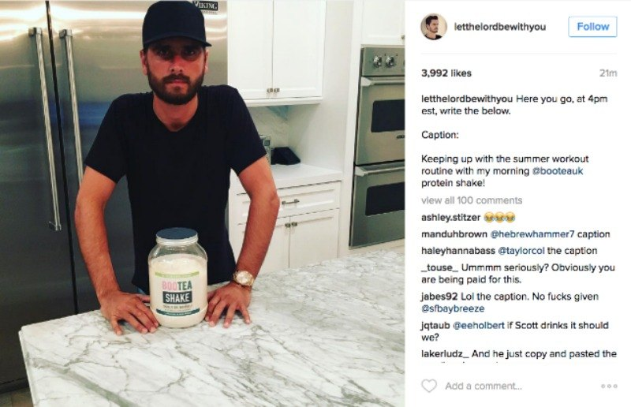
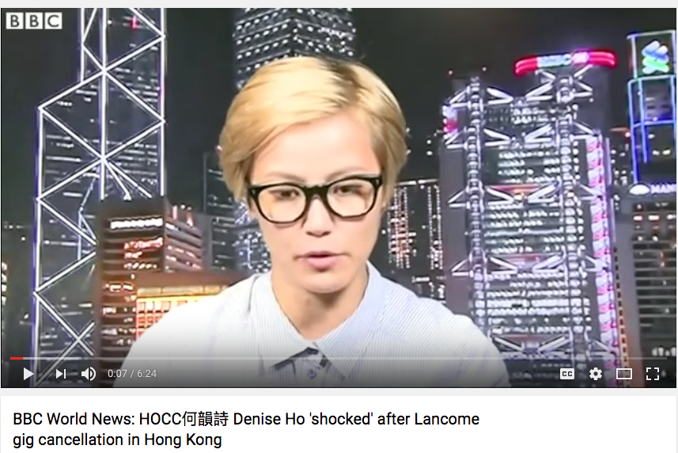
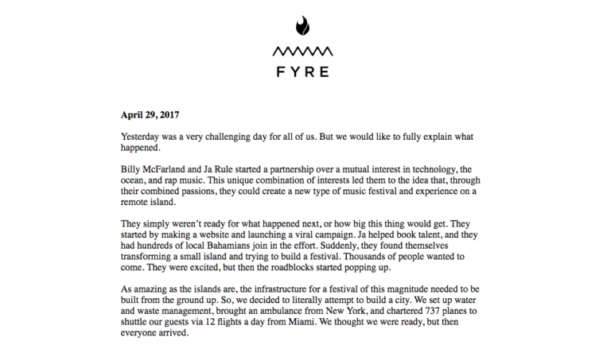
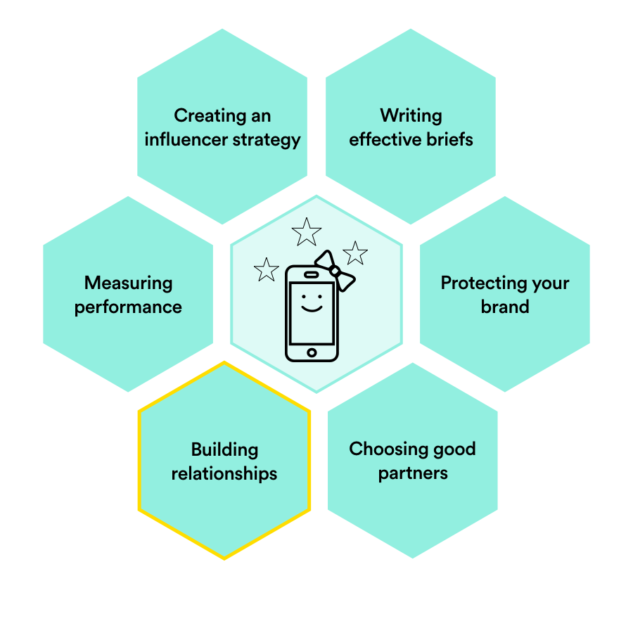

###### Influencer Marketing
# Eight Ways to Ruin an Influencer Relationship

| Lesson Assets    |
| ---------------- |
| [assets](lesson5/assets) |

----------------------------------

### Lesson + Instructor Info

_Lesson Title_:   Eight Ways to Ruin an Influencer Relationship

_Duration* (minutes)_:  20

### Summary Messages

##### Intro Screen
_Intro Message_:

##### Topics

* Best practices for relationship management
* Perspectives on the influencer side

##### References & Next Steps

----------------------------------
<!-- 1 -->
### Slideshow

_Slide Title_: Influencers are people

When you’re in the midst of planning an influencer campaign, it can be surprisingly easy to forget that influencers are human beings.

Many marketers think too short-term when it comes to influencers; they treat each influencer as one component of a single campaign. It is much better to play the long game; you should try to develop lasting relationships with your influencers. Over time, a one-time influencer can grow into a true brand advocate.

---
<!-- 2 -->
Influencer Relationship Management, or IRM, is no small part of executing this strategy successfully. In fact, some companies hire Influencer Relations Managers to manage these relationships.

  * *Approach relationships with influencers the same way you would approach any other relationship: try to build trust, communicate openly, and manage differences of opinion with respect.*

In this lesson, we’ll look at eight common mistakes that marketers make when working with influencers.

---
<!-- 3 -->
_Slide Title_: 1. Not knowing what you want

---
<!-- 4 -->
If a potential influencer senses that your campaign is disorganized and poorly planned, it’s possible that they will simply turn any offer you make them. This is particularly true for veteran influencers, who have probably had their fair share of frustrating or disappointing brand partnerships.  

Reaching out to an influencer is kind of like going on a first date: if your first impression isn’t solid, you’re not going to get past the first drink.

---
<!-- 5 -->
Before contacting an influencer, make sure that you know exactly what you want from them and what you can offer in return. This is what briefs are for!

This doesn’t mean your campaign has to be set in stone, but if you do change course:
  * Communicate any changes to your influencers promptly and succinctly.
  * Address any budgetary discrepancies the changes may cause.
  * Make sure there is someone available to answer influencers’ questions.

<!-- 6 -->
_Slide Title_: 2. Failing to think through all costs in advance

An influencer campaign may involve costs beyond basic content creation and distribution, such as:
* travel time
* expenses incurred while attending an event

---
<!-- 7 -->
It’s essential to be clear about what influencers will receive in exchange for their role in promoting your brand online. For instance:

* Will you pay their travel expenses to attend your product launch party?
* Will they be paid separate fees for creating and publishing content?
* How many posts are they expected to make, on which networks?
* Are they supposed to write any full-fledged blog posts?

---
<!-- 8 -->
Make sure you address all relevant questions about payment in your contract, and be ready to negotiate.

An important factor in building trust with an influencer is not underselling them. Do your research beforehand, and offer them a fair market value fee for each part of their service.  

*If an influencer feels like you’re dealing with them fairly from the get go, they will be much more likely to work with you again.*

---
<!-- 9 -->
_Slide Title_: 3. Having unrealistic timelines

Even top-tier influencers may have day jobs or other obligations that serve as sources of revenue. It’s important to keep this in mind and to remain flexible when discussing expectations.

If an influencer feels that you’re demanding too much from them in too little time, they’ll simply regard you as a short-term revenue source, as opposed to a potential long-term partner.

---
 <!-- 10 -->
You should work with an influencer to set a realistic timetable for content production. Taking photos, editing videos, writing blog posts, planning content calendars—this all take time.

As a general rule of thumb, try to give your influencers approximately two weeks to create and submit content for your campaign, as well as an additional 3 days for each round of revisions.

Being specific about your dates in your contract is also a good idea, but remember: influencers are humans. It’s never a bad idea to give yourself a bit of a buffer when planning.

---
<!-- 11 -->
_Slide Title_: 4. Being impersonal or transactional

Popular influencers have their inboxes flowing with briefs. A little personal outreach can get an influencer’s attention and set your relationship off on the right foot. For example, when first contacting an influencer, you might:

* Comment on a post you loved
* Mention a shared interest
* Explain why you think your brand and theirs are aligned

---
<!-- 12 -->
Even after a campaign is over, you should maintain an open line of communication with your influencers. Reaching out to influencers periodically to check in is a good idea, especially if you plan on working with them again in the future.

And if something goes wrong with the campaign, aim to communicate promptly with your influencer and attempt to resolve the issue.

**Remember**, these individuals have a large audience online - you don’t want them to use it to bash your brand.

---
<!-- 13 -->
For example, Denise Ho did a number of interviews while waiting for an explanation for her cancelled concert with Lancome.

---
<!-- 14 -->
_Slide Title_: 5. Trying to own their voice

Issues surrounding creative freedom can be thorny in influencer marketing. Brands often have trouble letting go of the reins and giving influencers the space to do what they do best: create engaging content in their own voice.

Some well-meaning brands might try to write out exactly what the influencers should say. This approach can backfire. In one famous influencer fail (pictured below), Scott Disick—who charges up to $20,000 for an Instagram post—clearly copied and pasted the text that was provided… but he failed to delete the directions.

---
<!-- 15 -->

If you try to micromanage the creative process, not only do you risk losing an influencer’s stake in the project, but you could also end up with disingenuous content.

Once the campaign brief has been agreed on, it’s best to step away and trust the influencer.

---
<!-- 16 -->
_Video Title_: Didi-Relationship

_Video Link_: placehold-ing.

---
<!-- 17 -->
_Slide Title_: 6. Forgetting to show appreciation

You need to give your influencers positive reinforcement. This might seem obvious, but it’s a crucial part of influencer marketing that’s often overlooked. Here are some good ways to make sure that your top influencers feel recognized for their work on a campaign:

* Let them know you’d like to work with them in the future and that they will always have a place within your brand.

* Send them a thank you note, or branded gifts. Sending out products after the campaign is over is a great way to stay in touch. (It might also earned you some unpaid promotion, too!)

---
<!-- 18 -->

* Work with your brand’s social media team to showcase their content and give some more authority to their personal brand. This will go a long way in fostering a lasting relationship.

* Keep an eye on their channels—an influencer might mention you organically or post on your behalf for free. Show some appreciation when this happens.

This is how brand advocates are made.  It doesn’t happen with a simple “thank you for your work.” It happens when the influencer feels a personal connection to your brand.

---
<!-- 19 -->
This is how brand advocates are made.  It doesn’t happen with a simple “thank you for your work.” It happens when the influencer feels a personal connection to your brand.

Ana Hoffman shares a number of examples of how she extends gratitude to influencers, like the one above, on her site.

---
<!-- 20 -->
_Slide Title_: 7. Blurring the legal lines

Your influencers may be experts at promoting content, but they are not experts in laws relevant to your industry. Your brand is responsible for knowing the ins and outs of any relevant laws.  

Make sure you communicate legal guidelines to influencers clearly. We’ll delve deeper into legal guidelines in the lesson on Protecting Your Brand.

---
<!-- 21 -->
_Slide Title_: 8. Expecting them to save you from yourself

Influencers are powerful amplifiers of the great things you’re already doing, but they’re not miracle workers!

If you don’t have a good product-market fit, you’re probably better off going back to the drawing board and improving the product, rather than trying to make it successful with influencer marketing.

---
<!-- 22 -->
A good example of this is the now-infamous Fyre Festival. The founders of the event used their influence to promote the event to great success, but they seem to have spent all of their energy on generating hype, without devoting any time to actually planning the event itself.

---
<!-- 23 -->
A couple of images that showcase the disaster that was Fyre Festival.

---
<!-- 24 -->
_Slide Title_: Bonus advice: Build a community!

Let’s say your brand works with multiple influencers on a regular basis.  You’re in contact with these influencers all time—why not connect them with each other?

Building a community for your influencers is a great way to foster long-term relationships with your brand, and it gives influencers the chance to bounce ideas off each other. Plus, if multiple influencers are promoting a campaign at the same time, a community can make them feel much more supported and engaged.

Influencer communities can be good for your bottom line, too. Take the case of Sprout Social’s “Sprout Social All Stars." In early 2016, Sprout made a Slack community to promote collaboration among its top influencers (the “All Stars”). In the first five months after the program launched, Sprout saw a 7% increase in monthly spend.

---
<!-- 25 -->
_Slide Title_: Expect the unexpected

We’ve talked about what you can do, but what about the influencers? A lot of the relationship issues can come from their end as well - the best you can do in these scenarios is be thoughtful in the influencers you choose to work with, and responsive when things go wrong.
William and Didi share more on this in the next two videos.

---
<!-- 26 -->
_Video Title_: William-Brief

---
<!-- 27 -->
_Video Title_: Didi-Hundred-Grand

---
<!-- 28 -->
_Slide Title_: Sweet!

You’ve learned about another skill on the influencer marketing honeycomb.

---
<!-- 29 -->
_Slide Title_: Next Steps

Managing influencers is a skill where practice will help you build your ability to respond to the various scenarios and nuances you encounter. Make sure you consider the time you will need to do this when you plan for your campaign.

* Courtney Canfield [offers advice](http://www.paceco.com/insights/strategy/working-with-influencers/) having worked both on the influencer and marketing side.

* A [CMO.com](http://www.cmo.com/opinion/articles/2017/1/24/majority-of-marketers-ready-to-get-strategic-about-influencer-relationships.html#gs.ZD67T=4) article explains how marketers are starting to think of their influencer relationships as part of their strategy.
