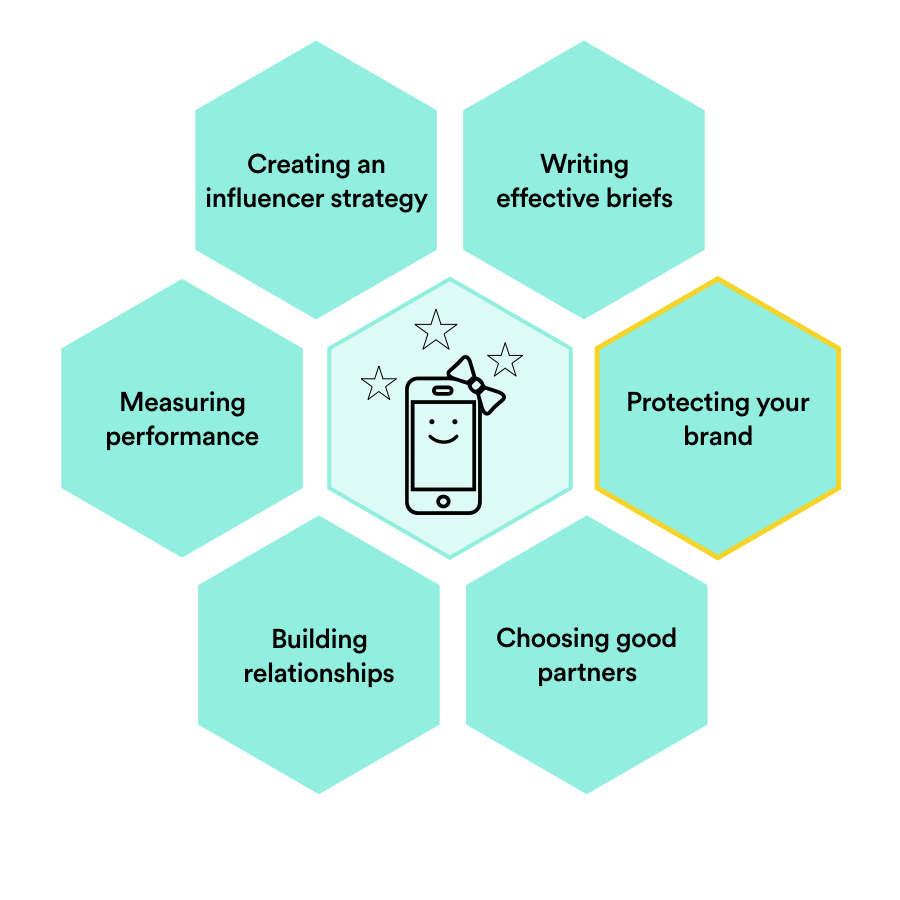

###### Influencer Marketing
# Protect Your Brand: A checklist for legal influencer marketing

| Lesson Assets    |
| ---------------- |
| [assets](lesson6/assets) |

----------------------------------

### Lesson + Instructor Info

_Lesson Title_:   Protect Your Brand: A checklist for legal influencer marketing

_Duration* (minutes)_:  20

### Summary Messages

##### Topics

* Influencer marketing ethics
* Disclosure requirements
* Working with legal
* Content and exclusivity rights

##### References & Next Steps

_Further Study_:
We’ve shared some best practices here to keep your brand safe, but the legality of influencer marketing remains a murky space.

If you’re working with an agency or MCN, they should be up to date on the laws relevant to your country and industry. Always do your homework and speak to your legal team!

* Stay up to date on [FTC guidelines](https://www.ftc.gov/tips-advice/business-center/guidance/ftcs-endorsement-guides-what-people-are-asking) in the US,  [ASAS guidelines](https://asas.org.sg) in Singapore, or [ASA guidelines](https://www.asa.org.uk/advice-online/affiliate-marketing.html) in the UK, and [around the world](https://zachbussey.com/influencer-marketing-laws-around-world/).

* Review some [examples](hey.com/influencer-marketing-outlaws/) of companies that have gotten into hot water by failing to disclose.

* See how a lawyer answers influencer marketing [legal questions](www.acorninfluence.com/blog/expert-answers-legal-influencer-marketing-questions/).
----------------------------------
<!-- 1 -->
_Video Title_: Influencer Ethics

_Video Link_: placeholder
_Video Transcript_: (maybe?)
<!-- 2 -->

Imagine you’re at dinner with a friend who has just gotten back from a vacation in Aruba. He can’t stop talking about Aruba. He tells you all about the amenities at the resort he stayed at, he shows you beautiful pictures of the island, and, by the end of the meal, he’s convinced you to take a trip to Aruba yourself.

You go to Aruba; you have a great time. But then you find out that your friend was paid to sell you on the trip—he got a fat commission from the resort after you booked your room. How would you feel about this friend? Wouldn’t you be frustrated that he hadn’t been more straightforward with you? Would you listen to his next recommendation?

Not surprisingly, some brands have taken heat for having influencers promote their products without making it clear that those influencers were being paid to do so.  In this lesson, we’ll look at some tips for avoiding legal headaches when working with influencers.

---
<!-- 3 -->
### Slideshow

_Slide Title_: Who’s watching?

Regulating bodies, like the FTC in the United States or ASAS in Singapore, are tasked with ensuring that brands, advertising agencies, and influencers do not deceive consumers with influencer marketing.

---
<!-- 4 -->
In April 2017, the FTC sent over 90 "reminder" letters to notable influencers in an effort to curb undisclosed sponsored posts. These letters mark the first time that the agency has reached out directly to social media influencers.

By sending these letters, the FTC indicated that it is not only aware of the pervasiveness of influencer marketing on social media, but that it is also familiar with some of the tactics that influencers use to downplay the fact that their posts are sponsored.

---
<!-- 5 -->
Regulatory bodies can update their rules as often as quarterly, so it is important to stay on top of their latest rulings.

Many countries have little to no formal requirements regarding disclosure as of yet. We recommend you still disclose following the guidelines of countries where the rules are more developed, but you will be less likely to be fined or penalized.

*Like most things legal, your requirements will vary based on your country and industry, so you’ll need to do some research to get familiar with the relevant requirements.*

---
<!-- 6 -->
_Slide Title_: Tip #1: Be upfront about disclosure

Disclosure rules can vary, but if you are paying for influencer promotion, you should find a way to let people know. In the US, FTC rules require that posts need to be labeled “clearly and conspicuously.”

Hashtags like “#sponsored”, “#paid”, or “#ad” are all good examples of clear disclosures, but avoid burying these hashtags in a list of other hashtags, or trying to disguise sponsorships in any way.

---
<!-- 7 -->
Disclosures (like “#sponsored”) must come before any links leading back to your brand’s landing page.

For Instagram in particular, disclosures should be above the "more" button at the end of the first three lines of caption text. (The odds that readers will click "more" and see that a post is sponsored are minimal.)

In a sponsored blog post, disclosures must be above the “fold” or “scroll.”

Audio content should include a verbal disclosure right away, and video content should present disclosures on a legible title card at the beginning of the video.

---
<!-- 8 -->
_Slide Title_: Tip #2:  Define the content rights upfront

There are two main questions surrounding content rights: “who owns the content?” and “how can the the content be used?”

  * Ownership of content: The influencer usually owns any content that is distributed through their own channels (even if a brand pays for it).

  * Usage rights: Knowing your own industry’s standards for usage rights is crucial. Content created by influencers may have to be removed from your brand’s social channels after a certain period of time (e.g., 3–6 months).  Also, the content may not be able to be repurposed and featured on TV or other media channels.

---
<!-- 9 -->
Generally, you should expect limited usage rights for content living on influencers’ channels. If you want to reuse influencers’ content for your own marketing purposes, make sure that you arrange for that explicitly in the contract.

Otherwise, you may need to draw up a separate licensing agreement and pay influencers royalties down the road.

---
<!-- 10 -->
_Slide Title_: Tip #3: Know your category

Make sure you understand the legal nuances of your brand’s category.  Laws and legal standards can vary widely from industry to x.

Pharma brands, for example, often require their influencers to disable comments, because influencers are usually not equipped to respond to medical questions from fans.

---
<!-- 11 -->
Facebook Live has become a popular way for healthcare organizations to conduct interviews with influencers; organizations can broadcast interviews on their own channels (and, therefore, control the comments).

Image: [Facebook / Mayo Clinic](https://www.facebook.com/MayoClinic/videos/10154343735332517/).

---
<!-- 12 -->
_Slide Title_: Tip #4: Lean on your legal team

Because regulations can vary by industry, country, and company, make sure to consult with your legal counsel at the outset of any influencer campaign.

This may be challenging at first; most legal departments aren’t used to the uncertainty that comes with an outside party distributing a message on behalf of a brand.

---
<!-- 13 -->
When Playtex Baby Canada started working with influencers, Playtex’s associate brand manager, Kayleigh Dunn, and her team had to work closely with the company’s lawyers and educate them about what working with influencers entails.

The legal team was used to handing over hefty documents filled with strict rules about what can and cannot be said about the brand.

Worried that all the rules and legal jargon would overwhelm influencers, the company translated them into a streamlined list of 10 dos and don’ts that were easy to understand.

---
<!-- 14 -->
_Slide Title_: Tip #5: Be clear about exclusivity

“Exclusivity” means that the influencers you work with will not work with any of your competitors for a certain period of time.

If exclusivity is important to you, you need to make sure that it’s stated explicitly in influencers’ contracts. (Note that most influencers expect to be compensated extra for exclusivity.)

Never assume that you have exclusivity unless it’s specifically agreed to. Many brands simply take exclusivity for granted. These brands can face an unpleasant surprise when an influencer promotes a competitor a few weeks later!

---
<!-- 15 -->
_Slide Title_: Tip #6: Define take down rights

“Take down rights” refers to an influencer’s ability to delete content after a certain period of time.

An influencer might want to do this if they’re trying to limit the sponsored content that lives on their channel, if they don’t feel like the content was true to their personal brand, or if they decide that the content was only relevant at a certain point in time (among other reasons).

Clearly express whether it’s okay for an influencer to take down content at any point (and, if so, when).

---
<!-- 16 -->
_Video Title_: Didi Comments
_Video Link_: placeholder
_Video Transcript_: What can you do if you get negative comments?

What do you do if you do an influencer marketing piece and the comments are terrible?

The best thing that I’ve seen brands do is get involved, particularly if they’re a progressive brand, and they say something quirky back, like “What didn’t you like about this? We’re listening.”

A lot of brands, when they put up a piece on the Internet, they think that’s the end of it. If you’re a smart brand and say, “Oh my gosh, you didn’t like this? Tell us more,” you can make it sound like more is coming from the brand and you actually are taking their input into account, and the next piece is going to incorporate their comments.

If you’re *truly a progressive brand*, figure out what’s wrong with your brand and change it for your audience. The thing is that you will get comments. People are so sensitive to brand placement. They’re sensitive, particularly to influencers who they can potentially feel duped by.

If your brand is suddenly front and center, and this influencer that they’ve trusted has never done that before, you’re going to get comments.

So, it’s a testament to listen to the influencer when they say it’s not going to work, it’s going to blow up in your face.

Have the can of tea or whatever in the background rather than front and center if that’s what the audience is expecting.

The other thing you can do is get involved and write back. Make a video about the comments, do a reactive piece, talk, have the influencer come back and talk about it. Just don’t let it be the end. I think the worst thing you can do is just ignore it all and put the project to sleep. Unless it’s not that bad. I mean you are going to get comments, you definitely will, everyone will respond, particularly if you’re in Taiwan [laughs].

This is their platform, right? For a lot of people, this is where they do the bulk of their talking. They want to be heard, so make sure that you’re listening.

---
<!-- 17 -->
_Slide Title_: Tip #7: Keep it real

Never create fake profiles to interact with or comment on influencers’ posts. Anyone doing this at your company needs to stop immediately.

Posing as a credible and impartial source is an absolute no-no, even if you’re using a real account. Always disclose any material relationship you have with an influencer, even if you’re just leaving a comment on a blog post.

---
<!-- 18 -->

For example, an early FTC suit was brought against Deutsch, a media agency, for having employees tweet about the new Playstation (one of their clients) without disclosing the relationship.  

---
<!-- 19 -->
_Slide Title_: Sweet!

You’ve learned about another skill on the influencer marketing honeycomb.

---
