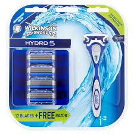
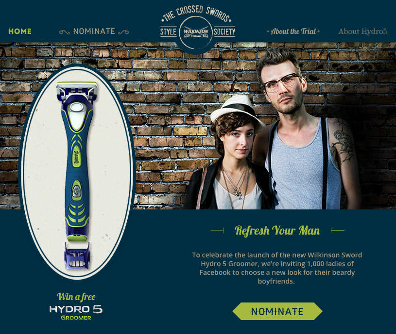
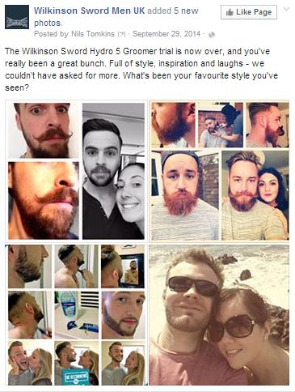
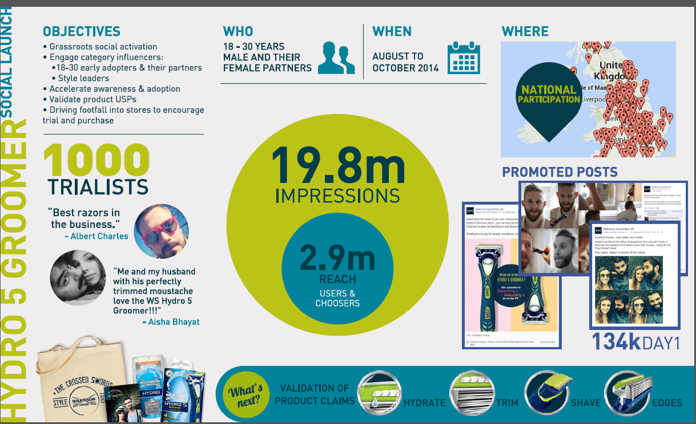

###### Influencer Marketing
# Solve-along Scenario: 
Influencer Marketing with Wilkinson Sword

| Lesson Assets    |
| ---------------- |
| [assets](lesson7/assets) |

----------------------------------

### Lesson + Instructor Info

_Lesson Title_: Solve-along Scenario: 
Influencer Marketing with Wilkinson Sword

_Duration* (minutes)_:  20

### Summary Messages

##### Intro Screen
_Intro Message_:

Our “Solve Along Scenario” series takes you through interesting case studies to help you execute a strategy along with the brand.

Note that the alternate answers provided are not necessarily wrong choices, but instead, serve as a way for you to compare your own approach to those who worked on the real campaign.

In this lesson, we’ll explore how Wilkinson Sword, a razor brand in the UK, used influencer marketing to set themselves up for success with a new product development and launch.

The case study and images are credited to Wilkinson Sword and Social Partners.

##### Topics

*
*
*

##### References & Next Steps

_Further Study_:
You can read the full case study [here](https://www.thesocialpartners.com/wilkinson-sword-case-study-facebook-couples/)

Video of the [case study](https://www.youtube.com/watch?v=wYcrshxc5tA)

Wilkinson Sword’s [Facebook Page](https://www.facebook.com/WilkinsonSwordMenUK/)

-------------------
<!-- 1 -->
### Slideshow

_Slide Title_: The Situation:

Wilkinson Sword is a UK-based brand that sells razors and shaving products for men nd women. They were launching a new “Hydro 5” razor, and wanted to drive trials of this new razor amongst their target audience - 18 to 30 year old men.

---
<!-- 2 -->
_Slide Title_: What would you do?

Given the strategy, goals, and target market, how might you use influencers for this campaign?

1. Have up and coming YouTube stars create funny videos where they used the razors to shave in public

2. Target influencers in their target audience’s real lives - their relationship partners - with Facebook ads aimed at incentivizing them to convince their partner to try the razor

3. Engage Instagram micro-influencers with a niche following related to mustache culture to participate in a “Reverse Movember” where instead of growing a mustache for a month, they shaved it off for a month

---
<!-- 3 -->
_Slide Title_: The Strategy:

Wilkinson Sword and their agency, The Social Partners, targeted women who were in relationships with bearded men with “highly targeted” ads promoting an opportunity to win a free trial of the product.

These ads also promoted an opportunity to win a joint style makeover, which was highly effective in driving submissions and collecting emails.

---
<!-- 4 -->
_Slide Title_: What would you do?

How would you, as Wilkinson Sword, leverage the submissions for the free trial and entry into the makeover promotion to extend your campaign?

1. Send everyone who entered one additional free razor for each post they publish mentioning Wilkinson Sword

2. Use the email addresses of the women who submitted entries into the contest to target everyone in their networks with additional ads

3. Identify the top style influencers from the submissions, and incentivize these individuals to post about them by counting each post about the razor as an entry to win the style makeover.

---
<!-- 5 -->
_Slide Title_: The Survey:

Wilkinson Sword and Social partners asked the entrants to complete an in-depth survey to identify who were the most influential participants of the group. They asked each entrant questions to discover:

* the level of social influence he had
* the degree to which he looked to partners and peers for affirmation on his style.
* how often he posted about products and services
* how often he met up with friends
* his social media presence and usage

---
<!-- 6 -->
They identified the top 1,000 influential entrants based on this survey, and sent them the new razor. They also encouraged these influencers to share their experiences and new styles they had created with the razor on Facebook, Twitter, and Instagram, in exchange for an opportunity to win the style makeover.

But they didn’t forget about the product itself - they also used regular surveys to gain feedback on the product feature claims, helping refine their messaging.

---
<!-- 7 -->
What would you do?

_Prompt_: Based on your efforts so far, you have thousands of posts from the influencers that entered this promotion featuring your razor. How would you leverage all this great user-generated content?

_Choices_:
1. Hire the men from the top-performing posts to appear in print ads and commercials

2. Share the top-performing posts within the Wilkinson Sword Facebook community and use them to create Facebook ads for lookalike audiences. *

3. Host an event which gives these men the opportunity to meet each other and exchange style tips

4. Find the most influential mustachioed man in the world and have him comment and share on the top posts

_Explanation_:

---
<!-- 8 -->
_Slide Title_: The Amplification:

Wilkinson Sword shared the posts within their Facebook community, which amplified the campaign and also built brand advocacy amongst the original posters.

They also put some paid media behind sharing these posts to Lookalike Audiences that they created from the profiles of their community members and contest entrants, generating positive comments and brand love.

---
<!-- 9 -->
What would you do?

_Prompt_: You’re getting ready to share the results of your campaign with your leadership. What metrics would you look to to evaluate success of this campaign? (choose all that apply)

1. Number of submissions to become a trialist
2. Number of posts created by the trialists
3. Earned impressions from WOM and social shares *
4. Purchase intent from the trialists *
5. Market share *

_Explanation_:

---
<!-- 10 -->
_Slide Title_: The Results:

Wilkinson Sword and Social Partners may have measured all of the items mentioned, but these were the KPIs they described when sharing their success:

* Before the start of the campaign, 57% of our trialists were using Gillette razors. By the end, nine out of 10 said they planned to switch to Wilkinson Sword.
* 89% of trialists said they planned to make the Hydro 5 Groomer their main razor
* 93% of the trialists’ partners intended to purchase replacement blades for their partners
* Trialists AND partners told an average of 6.3 people about their involvement in the campaign.
* Stories surfaced on Facebook generated a further 19.8 million impressions.
* During the period in which the campaign ran, Hydro male systems value share exceeded 9% in the UK for the first time ever, reaching a record high of 9.2%.
* Hydro male handle value share reached 16.8% with Groomer NPD contributing 4.4%.
* Across the three months in which the campaign was running, Gillette had their lowest share in the last 16 months.

---
<!-- 11 -->

---
