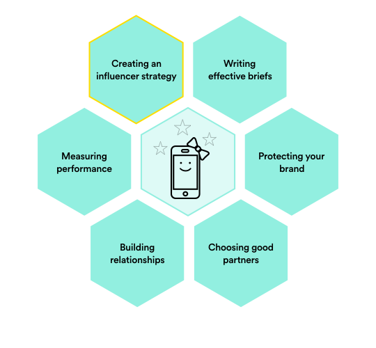
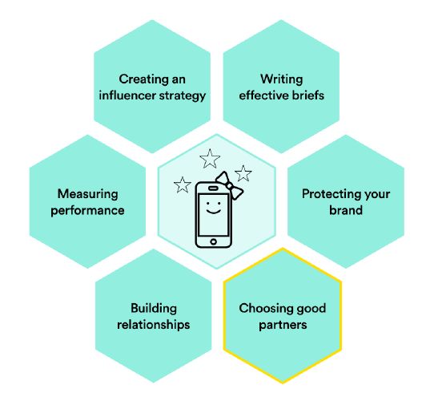
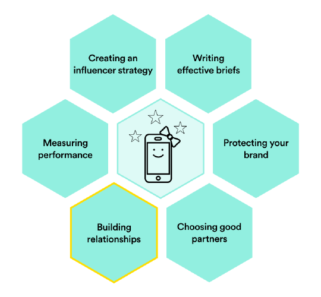
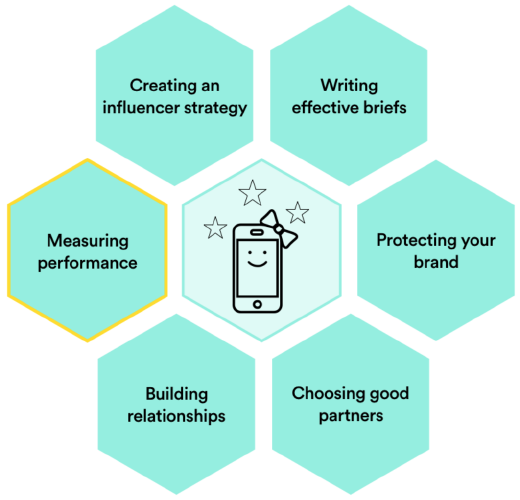
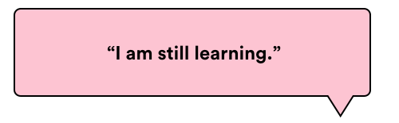

###### Influencer Marketing
# Questions to Ask When Evaluating an Influencer Campaign

| Lesson Assets    |
| ---------------- |
| [assets](assets/) |

----------------------------------
### Lesson + Instructor Info

_Lesson Title_: Questions to Ask When Evaluating an Influencer Campaign

_Duration* (minutes)_:  20

### Summary Messages

##### Topics
* How to evaluate an Influencer Campaign

-------------------
<!-- 1 -->
### Slideshow
_Slide Title_: It’s All About Learning

Reflection and learning are critical parts of the process.

Whether the campaign was planned and executed by yourself, your agency, or your team, these eight questions will help you assess your hits and misses, allowing you to improve in the future.

You can also use this list to investigate your strategy before you take action and help you plan for the successes you hope to achieve!

---
<!-- 2 -->
_Slide Title_: Question 1: Why Was Working With Influencers the Right Approach?

Recall the five benefits of influencer marketing we listed in the intro lesson:
- Build trust with consumers.
- Save on content production.
- Adapt content to local markets.
- Target specific audiences.
- Reach digital natives.

Did you choose influencer marketing to take advantage of these (or other) unique benefits, or because it is trendy and fun? Make sure you can articulate why you believe influencer marketing is/was more effective than other approaches, especially if you work in a risk-averse organization.

---
<!-- 3 -->
_Slide Title_: Question 2: How Did You Select These Influencers?

Choosing the right influencers can be the most challenging part of influencer marketing. If the answer is simply based on follower count, dig deeper.
The answer should include factors such as:

- Reach.
- Audience make up.
- Engagement rates and ability to drive action among followers (resonance).
- Connection to your brand’s values and passion points (relevance).
- Enthusiasm for your brand.
- Professionalism.

Review the lesson on choosing influencers for more details on selection criteria.

---
<!-- 4 -->
_Slide Title_: Question 3: What’s the Long-Term Plan for the Brand Relationship With These Influencers?

Influencer relationships pay dividends when they are nurtured over time. Many brands are beginning to think of influencers as part of the brand strategy, and choose brand ambassadors as part of a long-term plan.

This isn’t necessary for every influencer relationship or campaign, but you should at least consider if and how you might want to work with the influencers again in the future.

If there is no plan for the future, that’s OK, but it should be a conscious decision, not the result of poor relationship management!

---
<!-- 5 -->
_Slide Title_: Question 4: What Did We Learn from Working With Influencers About Our Brand and Our Target Market?

Customer insights are gold to marketers, and when you work with influencers, you have a direct line to your target market.

Now that you’ve built some trust with your influencers, get their candid feedback on your product and brand. Ask them what their followers thought, and read the comments!

You don’t have to follow through on everything they suggest, but you might uncover some fresh perspectives and customer insights that you couldn’t get from a study.

---
<!-- 6 -->
_Slide Title_: Question 5: How Did Our Influencer Content Perform, Compared to Our Brand Content? Our Digital Ads?

Presumably, influencer marketing isn’t the only type of marketing you’re doing. Compare the cost and effectiveness of your influencer content against your brand’s content, digital ads, and any other tactics you find relevant.

Look at the full funnel — how much did you spend? How many people did you reach? What percentage were in your target audience? What was the engagement rate? What drove the most traffic to your site? Which of those traffic sources is the highest converting? Which tactic has the lowest cost per acquisition? Which drives the highest-quality acquisitions?

Comparing across the funnel will help you identify how to best use influencer marketing in your digital strategy. If it’s working well for driving reach and engagement, but not traffic, you might nudge that audience toward the next step with targeted search and display ads.

---
<!-- 7 -->
_Slide Title_: Question 6: What Did We Achieve?

Measuring influencer marketing can be challenging, but that’s not an excuse not to do it.

We shared a number of ways you can measure your campaign in the influencer measurement lesson, and hopefully you chose your key KPIs upfront in the brief.

If the numbers aren’t good, make like a toddler and ask yourself why, as many times as you can, to find some possible reasons. For example:  

- The campaign didn’t drive as many acquisitions as we’d hoped.
_Why_?
- The influencers didn’t seem to make much of an effort.
_Why_?
- They didn’t seem invested in the brand or campaign.
_Why_?
- Maybe they were poor choices, maybe the engagement was too short for them to invest much effort, or maybe we didn’t engage them sufficiently in the beginning and give them creative license.

You get the picture. The closer you can get to pinpointing some possible reasons, the closer you come to success in your next campaign.

Because influencer marketing is human-powered, you can even talk to your influencers or agencies to find out what happened.

---
<!-- 8 -->
_Slide Title_: Question 7: How Are We Amplifying and Reusing the Content We’ve Got?

If you got a lot of high-quality, evergreen content from this campaign, use it! True content masters stretch their quality content to the max.

Do a quick “fail fast” exercise with your team. This is a good opportunity to include those who weren’t involved in the execution, such as sales or product teams, to see if there’s an opportunity to extend the value of your work.

1. Set the stage for an open room where bad ideas are welcome.
2. Do a rapid-fire brainstorm where everyone comes up with all the possible ways you could amplify, reuse, or remix the content from this campaign.
3. Evaluate and move forward with promising ideas.

---
<!-- 9 -->
_Slide Title_: Question 8: What Should We Do Differently Next Time?

Whether or not your campaign succeeded based on your expectations, take time to reflect on what went well, what didn’t go well, and why.

If everything went great, was there something you did that set it up for success? Did you write a great brief? Work with a killer agency? Find amazing influencers?

If your answer is yes to all of the above, what else could you try — a different format, or a different type of campaign? Share what you learned with your colleagues, and push yourself to keep experimenting!

Don’t beat yourself up if things didn’t go well but aim to isolate one or two factors that can become institutionalized learnings, and then change your approach for next time.

— Michelangelo at age 87

---
